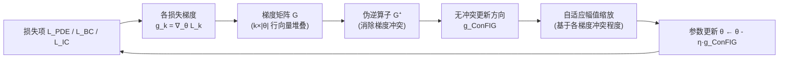

---
tags:
  - AI
  - PINN
  - 论文汇报
  - 自适应权重
date: 2026-06-05
paper_title: "ConFIG: Towards Conflict-free Training of Physics Informed Neural Networks"
venue: "ICLR 2025"
venue_grade: "顶会（A类对待）"
arxiv: "2408.11104"
---

# ConFIG：无冲突梯度方向训练 PINN（ICLR 2025）

## 方法图示

> 论文核心是「梯度方向冲突 → 伪逆消冲突」，用 `flowchart LR` 展示单次迭代更新链路。

## 元信息

- **作者 / 年份**：Qiang Liu, Mengyu Chu, Nils Thuerey（TU Munich + Peking University），2024/2025
- **发表于**：The Thirteenth International Conference on Learning Representations (ICLR 2025)（等级：顶会 A 类对待）
- **链接**：https://arxiv.org/abs/2408.11104 | https://tum-pbs.github.io/ConFIG
- **引用数**：arXiv 版本（2024），会议版本 2025

## 核心内容

PINN 训练时，PDE 残差梯度与边界/初值条件梯度常**方向冲突**，导致某一损失项优化停滞。ConFIG 方法通过计算损失梯度矩阵的**伪逆**，给出一个与所有损失特定梯度均保持正点积的更新方向，同时按冲突程度自适应缩放幅值。变体 M-ConFIG 用交替动量替代每步全量反传，大幅降低计算开销。

## 创新点

1. **理论保证**：数学证明 ConFIG 方向与每个损失梯度的点积均非负（即无优化方向冲突）。
2. **幅值自适应**：更新步长根据各梯度冲突程度动态缩放，比固定统一步长更均衡。
3. **M-ConFIG 加速**：交替反传不同损失项动量，与全量反传相比运行时间显著下降。
4. **通用性**：在多任务学习（MTL）基准上同样表现优异，不限于 PINN。

## 相关汇报

| 汇报 | 关联理由 |
|------|----------|
| [[2026-06-04/01-BRDR-平衡残差衰减率]] | BRDR 用残差衰减率加权缓解梯度不均，ConFIG 从梯度方向冲突角度直接纠正；二者可组合（BRDR 做项内点权，ConFIG 做项间方向）。 |
| [[2026-06-04/05-NTK-特征值加权]] | NTK 分析揭示梯度失衡的频谱根因，ConFIG 是解法之一；二者共同定位「梯度冲突 → 收敛失败」链路。 |
| [[2026-06-04/03-DB-PINN-双层次平衡]] | DB-PINN 用统计难度平衡项间权重，ConFIG 用伪逆平衡梯度方向；均针对 inter-loss 失衡，可对比实验。 |
| [[2026-06-04/12-NeurIPS-失败模式与课程学习]] | NeurIPS 论文分析了梯度冲突导致训练失败，ConFIG 提供了一个直接消除冲突的优化器级解法。 |
| [[2026-06-04/08-MOO-VARI-多目标优化加权]] | MOO-VARI 用 Pareto 前沿处理多目标，ConFIG 用伪逆处理梯度冲突；均可归类为「方向级」多目标策略，可比较。 |

## 与我研究的关联

声波正演三项损失（L_PDE / L_S / L_PC）常出现 L_S 主导梯度而 L_PDE 停滞的现象，ConFIG 伪逆方向可直接替换当前 Adam 更新，与 C 方案自适应 λ 正交，值得作为优化器改进项加入对比实验。

## 备注

- 汇报批次：2026-06-05 第 2 次触发

## 本地 PDF

![[2408.11104.pdf]]

- arXiv：https://arxiv.org/abs/2408.11104
- 文件：`每日论文/2026-06-05/2408.11104.pdf`
