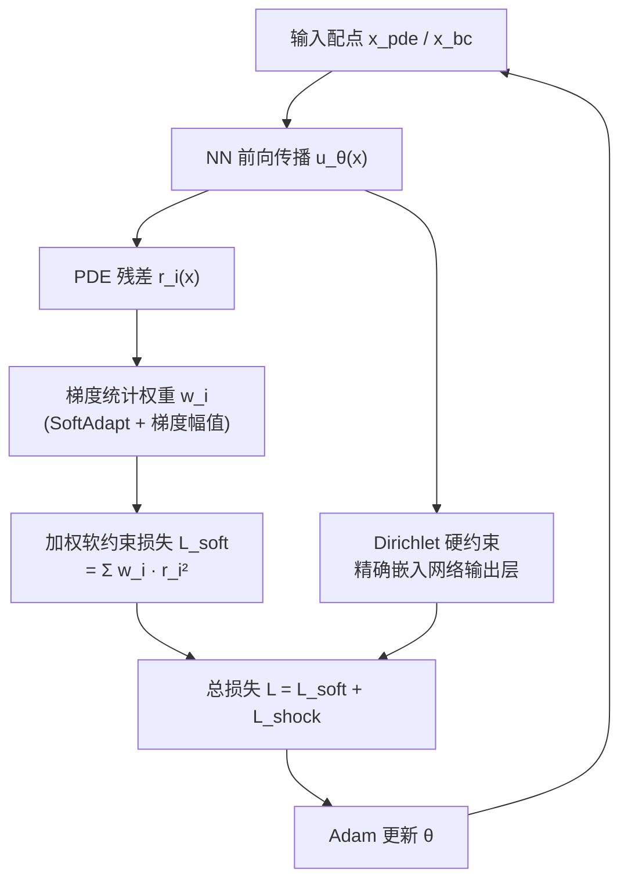

---
tags:
  - AI
  - PINN
  - 论文汇报
  - 自适应权重
date: 2026-06-05
paper_title: "Physics-informed neural network with weighted loss and hard constraints for hyperbolic conservation laws"
venue: "Scientific Reports"
venue_grade: "SCI"
doi: "10.1038/s41598-025-34263-1"
---

# WHC-PINN：加权软损失 + 硬约束处理双曲守恒律（Scientific Reports 2025）

## 方法图示

> 论文核心是「梯度加权软约束 + Dirichlet 硬约束双轨」，用 `flowchart TD` 展示两条约束路径。

## 元信息

- **作者 / 年份**：M. S. Ghoreishi, H. Naderan，2025
- **发表于**：Scientific Reports 16, 4201（2026）（等级：SCI）
- **链接**：https://doi.org/10.1038/s41598-025-34263-1
- **引用数**：新发表

## 核心内容

面向**双曲守恒律**（含激波间断）的 PINN 训练挑战：PDE 损失与边界条件损失梯度因激波区域高度不均匀而难以平衡。WHC-PINN 将 **SoftAdapt 相对进展权重**与**局部梯度幅值权重**结合，对 PDE 残差逐点加权；同时将 Dirichlet 边界条件作为**硬约束精确嵌入网络输出结构**（而非软惩罚项），彻底消除 BC 损失梯度与 PDE 损失竞争。

## 创新点

1. **双轨约束架构**：BC 硬嵌入（精确满足）+ PDE 梯度加权软损失，各司其职。
2. **激波感知加权**：在激波附近梯度幅值大的区域自动分配更高权重，增强间断捕捉。
3. **SoftAdapt 统计驱动**：损失统计（非梯度统计）权重更新，计算代价低于 GradNorm 类方法。
4. **数值实验**：Riemann 问题、激波管等双曲算例上均优于纯软约束 PINN。

## 相关汇报

| 汇报 | 关联理由 |
|------|----------|
| [[2026-06-04/06-RBA-残差注意力]] | RBA 做点级注意力权重，WHC-PINN 做点级梯度权重；均针对配点分布不均，方法思路相近，适合对比。 |
| [[2026-06-04/13-vRBA-变分残差注意力]] | vRBA 用变分框架解释点权，WHC-PINN 用梯度统计做点权；可与激波算例对比精度和稳定性。 |
| [[2026-06-04/04-ReLoBRaLo-相对损失平衡]] | WHC-PINN 部分借鉴 SoftAdapt（ReLoBRaLo 同源），将其与梯度权重融合；ReLoBRaLo 也可迁移到激波场景。 |
| [[2026-06-04/12-NeurIPS-失败模式与课程学习]] | NeurIPS 文章指出初始/边界条件失败模式，硬约束策略是系统性解决 BC 失败的方案之一。 |
| [[2026-06-05/03-gPINN-梯度增强损失]] | gPINN 也在损失中加入物理梯度项增强训练，与 WHC-PINN 的激波梯度加权思路异曲同工。 |

## 与我研究的关联

声波正演中 L_S（快照损失）近似于数据约束，可尝试改为硬约束精确嵌入（而非软惩罚），将 PDE 损失从竞争中解放；激波加权思路对高速度梯度区（层状界面处）有参考价值。

## 备注

- 汇报批次：2026-06-05 第 2 次触发
