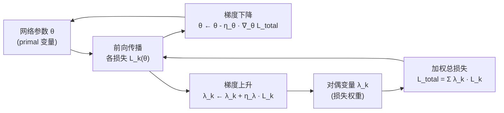

---
tags:
  - AI
  - PINN
  - 论文汇报
  - 自适应权重
date: 2026-06-05
paper_title: "Accuracy and Robustness of Weight-Balancing Methods for Training PINNs"
venue: "arXiv preprint"
venue_grade: "预印本（WASP 资助，2025-01）"
arxiv: "2501.18582"
---

# PD-PINN：原始对偶框架提升权重平衡鲁棒性（arXiv 2025）

> **注意**：本文为 arXiv 预印本（arXiv:2501.18582），暂无正式发表记录（WASP 资助）。因该子方向目前高相关预印本较多，特收录并标注。

## 方法图示

> 原始对偶（Primal-Dual）框架是一个鞍点问题，`flowchart LR` 展示 primal/dual 交替更新环路。

## 元信息

- **作者 / 年份**：（WASP / Wallenberg AI Program，Sweden），2025
- **发表于**：arXiv preprint，arXiv:2501.18582（2025-01）
- **链接**：https://arxiv.org/abs/2501.18582
- **引用数**：预印本阶段

## 核心内容

本文从**概率视角**定义 PINN 训练的「准确性」和「鲁棒性」，系统评估现有权重平衡方法（ReLoBRaLo、NTK 加权、LR Annealing 等）并指出其鲁棒性短板。提出基于**原始对偶（PD）优化框架**的训练算法：将损失权重 λ 视为对偶变量，通过梯度**上升**更新（使违反物理约束的损失增大对应权重），与网络参数梯度下降交替进行，得到比纯启发式权重更稳健的解。

## 创新点

1. **概率鲁棒性指标**：首次将 PINN 训练结果的可靠性量化为概率指标，用于比较不同权重策略。
2. **原始对偶权重更新**：λ 通过 dual ascent 自动增大违约约束项权重，理论上收敛到 Lagrangian 鞍点。
3. **低计算开销**：PD 更新与前向/反向传播同步进行，无需额外 backward pass。
4. **停止准则分析**：给出收敛的概率停止准则，缩短无效训练时间。

## 相关汇报

| 汇报 | 关联理由 |
|------|----------|
| [[2026-06-04/07-AL-PINN-增广拉格朗日]] | AL-PINN 也用 Lagrangian 乘子框架，但用增广拉格朗日二次惩罚；PD-PINN 用纯对偶上升，二者是同一框架的不同变体，可直接对比收敛速度与稳健性。 |
| [[2026-06-04/08-MOO-VARI-多目标优化加权]] | MOO-VARI 用 Pareto/NSGA-II 多目标优化，PD-PINN 用对偶上升；均属多目标框架，差异在于 Pareto 前沿探索 vs 鞍点收敛。 |
| [[2026-06-04/11-BPINN-贝叶斯自适应加权]] | BPINN 从贝叶斯角度评估鲁棒性；PD-PINN 从概率准确性/鲁棒性指标角度评估；两篇可组成「PINN 训练可靠性」专题。 |
| [[2026-06-04/04-ReLoBRaLo-相对损失平衡]] | 本文系统评估了 ReLoBRaLo 等方法鲁棒性不足，是其发表后的直接跟进与批评性分析。 |

## 与我研究的关联

声波正演偶尔出现训练不稳定（L_PDE 忽大忽小），PD 框架的「λ 对违约约束自动涨权」机制可直接嵌入 C 方案训练循环，作为 `RelativeProgressLambdaWeights` 的对偶上升替代版本验证。

## 备注

- 汇报批次：2026-06-05 第 2 次触发
- 预印本，暂无期刊/会议正式发表；WASP 资助，作者机构可信。
