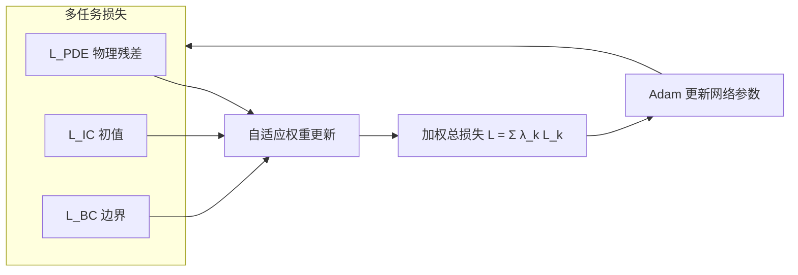
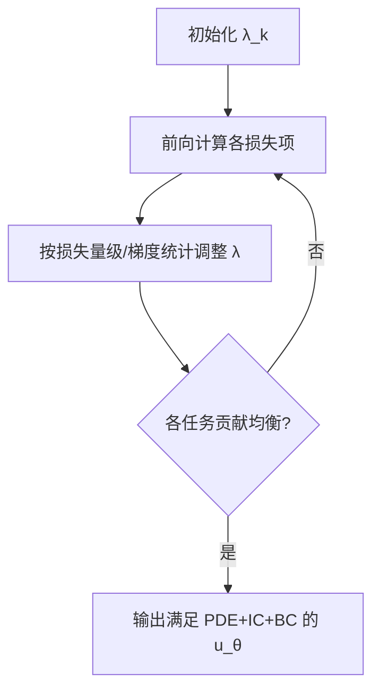

---
tags:
  - AI
  - PINN
  - 论文汇报
  - 自适应权重
date: 2026-06-06
paper_title: "Physics-informed neural networks with adaptive loss weighting algorithm for solving partial differential equations"
venue: "Computers & Mathematics with Applications"
venue_grade: "SCI"
doi: "10.1016/j.camwa.2025.01.007"
---

# APINN：多任务视角的自适应损失加权（Gao et al. 2025）

## 方法图示

> 将 PINN 训练显式建模为多任务学习，在线平衡各损失项量级。

## 元信息

- **作者 / 年份**：Bo Gao, Ruoxia Yao, Yan Li, 2025
- **发表于**：Computers & Mathematics with Applications, Vol. 181（等级：SCI）
- **链接**：https://doi.org/10.1016/j.camwa.2025.01.007 | https://papers.ssrn.com/abstract=4916430
- **引用数**：待查（2025 年新发表）

## 核心内容

将 PINN 训练视为**多任务学习（MTL）**问题，提出 APINN 自适应损失加权算法，在训练过程中动态平衡 PDE 残差、初值与边界各损失项的量级，使不同量纲/尺度的参数对总损失贡献均衡。在 Benjamin-Ono 孤波、Sine-Gordon 与 Mukherjee-Kundu 呼吸子波等 benchmark 上，相对固定权重 PINN 预测误差可降低约一个数量级（BO 方程从 ~60% 降至 ~1%）。

## 创新点

1. 从 MTL 框架重新表述 PINN 多目标优化，而非仅作启发式调 λ。
2. 自适应算法在训练全程在线更新权重，无需手工网格搜索各损失系数。
3. 在强非线性波动方程（BO、SG）上展示显著精度提升，验证项级平衡对复杂 PDE 的必要性。
4. 与 GradNorm/SoftAdapt 等 MTL 方法形成对照，但专门针对 PINN 物理约束结构定制。

## 相关汇报

| 汇报 | 关联理由 |
|------|----------|
| [[2026-06-04/04-ReLoBRaLo-相对损失平衡]] | 同为 **项级多目标损失平衡**：ReLoBRaLo 用随机回看损失比率，APINN 用 MTL 自适应量级；可作对照基线。 |
| [[2026-06-04/03-DB-PINN-双层次平衡]] | DB-PINN 分 inter/intra 两层平衡，APINN 聚焦项间量级；可组合「MTL 项级 + 条件内难度」实验。 |
| [[2026-06-04/08-MOO-VARI-多目标优化加权]] | 均将 PINN 视为多目标优化；MOO-VARI 用 Pareto/NSGA-II，APINN 用在线自适应 λ，方法论互补。 |
| [[02-IDW-逆Dirichlet梯度方差加权]] | 今日另一篇项级加权：IDW 基于梯度方差，APINN 基于损失量级/MTL；可对比「损失统计 vs 梯度统计」。 |

## 与我研究的关联

你的 2D 声波 PINN 有四项损失（PDE/快照/边界/初值），APINN 的 MTL 项级平衡可直接替换固定 `λ_pde, λ_snap` 等超参；首个实验可在现有 `losses.py` 四项损失上实现在线 λ 更新，与 ReLoBRaLo 做消融。

## 备注

- 汇报批次：2026-06-06 第 1 次触发（浅海三文鱼）

## 本地 PDF

> 暂无本地 PDF（本篇无 arXiv 预印本，仅期刊/会议发表）。

- DOI：https://doi.org/10.1016/j.camwa.2025.01.007
