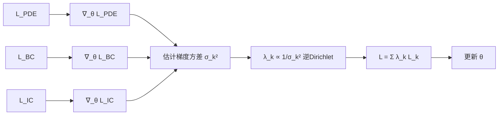
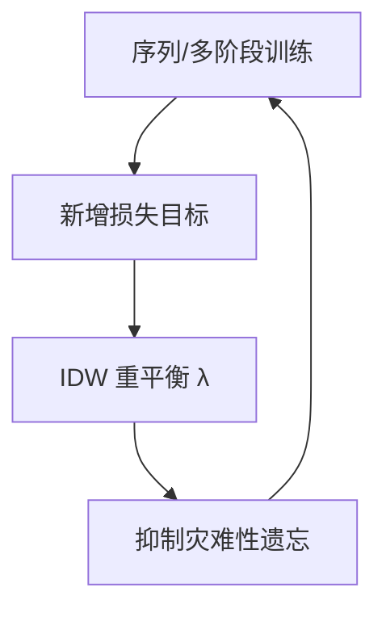

---
tags:
  - AI
  - PINN
  - 论文汇报
  - 自适应权重
date: 2026-06-06
paper_title: "Inverse Dirichlet weighting enables reliable training of physics informed neural networks"
venue: "Machine Learning: Science and Technology"
venue_grade: "SCI"
doi: "10.1088/2632-2153/ac3712"
arxiv: "2107.00940"
---

# IDW：逆 Dirichlet 梯度方差加权（Maddu et al. 2022）

## 方法图示

> 用各损失项梯度方差的倒数动态加权，防止某项梯度消失或主导。

## 元信息

- **作者 / 年份**：Suryanarayana Maddu, Dominik Sturm, Christian L. Müller, Ivo F. Sbalzarini, 2022
- **发表于**：Machine Learning: Science and Technology, Vol. 3（等级：SCI）
- **链接**：https://doi.org/10.1088/2632-2153/ac3712 | https://arxiv.org/abs/2107.00940
- **引用数**：100+（被 PD-PINN、梯度统计综述等广泛引用）

## 核心内容

指出 PINN 多目标训练中，尺度失衡、异方差数据、刚性方程或多尺度动力学可导致**任务特定梯度消失**与优化偏置。提出 **逆 Dirichlet 加权（IDW）**：各损失权重与其梯度方差成反比，并配合平滑滤波，使各目标对参数更新的贡献更均衡。在多尺度主动湍流模型上相对误差与收敛速度可提升数个量级；序列训练中还能缓解灾难性遗忘。

## 创新点

1. 从梯度方差（不确定性）角度解释 PINN 训练失败，与 Wang LRA（梯度模长）形成对照。
2. IDW 公式简洁，无需辅助网络或 NTK 矩阵，计算开销低于 GradNorm。
3. 证明对多尺度、序列训练、逆问题均有效，强调**鲁棒性**而非仅前向精度。
4. 与 Sobolev 训练对比，给出 analytically ε-optimal 基线参照。

## 相关汇报

| 汇报 | 关联理由 |
|------|----------|
| [[2026-06-04/05-NTK-特征值加权]] | 均从**训练动力学**解释多损失不平衡：NTK 用特征值，IDW 用梯度方差；可并列作为项级权重机理对照。 |
| [[2026-06-04/04-ReLoBRaLo-相对损失平衡]] | ReLoBRaLo 看损失比率历史，IDW 看梯度方差；同属项级自适应，实现成本不同。 |
| [[2026-06-05/06-PD-PINN-原始对偶鲁棒训练]] | PD-PINN 综述并对比 IDW 与积分控制器；IDW 是 PD-PINN 实验基线之一，适合串联阅读。 |
| [[01-APINN-多任务自适应加权]] | 今日 APINN 用损失量级 MTL 平衡，IDW 用梯度方差；天然消融组合。 |

## 与我研究的关联

可在训练循环中统计 `loss_pde/ic/boundary/snapshot` 各分项对 θ 的梯度方差（滑动窗口），按 IDW 更新四项 λ；特别适合你项目中 PDE 残差梯度长期偏大的问题，且比 GradNorm 少一次分项 backward。

## 备注

- 汇报批次：2026-06-06 第 1 次触发（浅海三文鱼）

## 本地 PDF

![[2107.00940.pdf]]

- arXiv：https://arxiv.org/abs/2107.00940
- 文件：`每日论文/2026-06-06/2107.00940.pdf`
