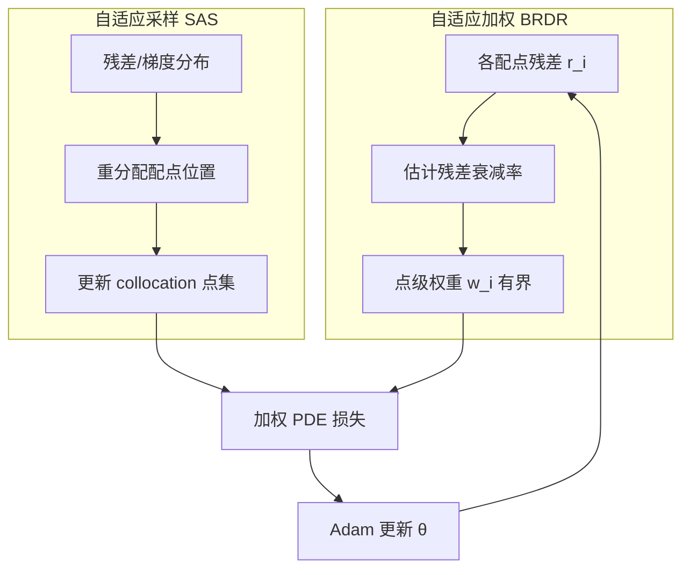
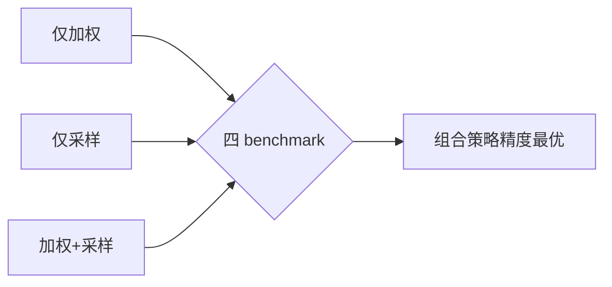

---
tags:
  - AI
  - PINN
  - 论文汇报
  - 自适应权重
date: 2026-06-06
paper_title: "Self-adaptive weighting and sampling for physics-informed neural networks"
venue: "Machine Learning: Science and Technology"
venue_grade: "SCI"
doi: "10.1088/2632-2153/ae556e"
arxiv: "2511.05452"
---

# BRDR-SAS：自适应加权与残差采样联合框架（Chen et al. 2025）

## 方法图示

> BRDR 点级加权 + 残差驱动自适应采样，双机制互补。

## 元信息

- **作者 / 年份**：Wenqian Chen, Amanda A. Howard, Panos Stinis, 2025
- **发表于**：Machine Learning: Science and Technology, Vol. 7（等级：SCI）
- **链接**：https://doi.org/10.1088/2632-2153/ae556e | https://arxiv.org/abs/2511.05452
- **引用数**：待查（2025 预印本 / 2026 正式发表）

## 核心内容

在先前 BRDR 点级自适应加权基础上，提出**残差驱动自适应采样（SAS）**，将「平衡各配点收敛速率」与「向难区/高残差区增配点」结合为统一框架。实验表明：单独加权或单独采样均不足以在所有 benchmark 上稳定高精度，尤其在配点稀少时；**二者联合**可一致提升预测精度与训练效率。

## 创新点

1. 首次系统论证 PINN 中**加权与采样互补**：加权调损失贡献，采样调空间覆盖，问题依赖性强。
2. SAS 基于残差/梯度识别快变区域，与 RBA 注意力、AMAW 配点移动形成方法谱系。
3. 延续 BRDR 作者群（PNNL），与 [[2026-06-04/01-BRDR-平衡残差衰减率]] 直接承接。
4. 四个 benchmark 上组合策略稳定优于单机制，给出配点预算敏感性的实证分析。

## 相关汇报

| 汇报 | 关联理由 |
|------|----------|
| [[2026-06-04/01-BRDR-平衡残差衰减率]] | **直接扩展**：本篇加权组件即 BRDR；必读前后篇对照理解点级衰减率机制。 |
| [[2026-06-04/06-RBA-残差注意力]] | RBA 用累积残差做点权（无梯度），本篇 SAS 用残差做采样；同属残差驱动自适应。 |
| [[2026-06-05/01-AMAW-PINN-配点与损失联合自适应]] | AMAW 联合移动配点与 NLL 加权，本篇联合 BRDR 加权与残差采样；可设计三方法对照实验。 |
| [[2026-06-05/03-gPINN-梯度增强损失]] | gPINN 用梯度残差+RAR 采样，本篇用 BRDR 权重+残差采样；采样动机相近、权重机制不同。 |

## 与我研究的关联

2D 声波正演可在 PDE collocation 上同时启用 BRDR 点权与残差重采样（波前/源区加密），而不改动快照监督项；与现有 `pde_residual_normalized` + 固定均匀配点形成清晰对照。

## 备注

- 汇报批次：2026-06-06 第 1 次触发（浅海三文鱼）

## 本地 PDF

![[2511.05452.pdf]]

- arXiv：https://arxiv.org/abs/2511.05452
- 文件：`每日论文/2026-06-06/2511.05452.pdf`
