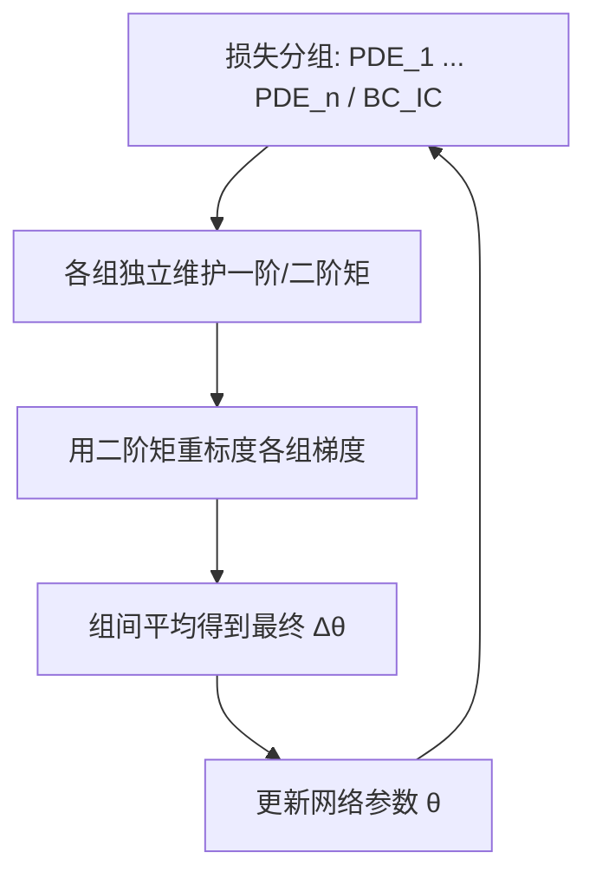
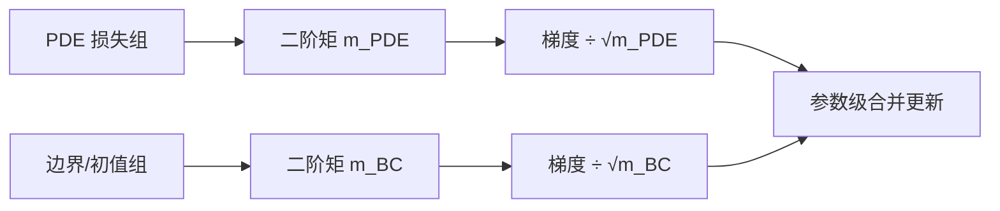

---
tags:
  - AI
  - PINN
  - 论文汇报
  - 自适应权重
date: 2026-06-06
paper_title: "MultiAdam: Parameter-wise Scale-invariant Optimizer for Multiscale Training of Physics-informed Neural Networks"
venue: "International Conference on Machine Learning (ICML 2023)"
venue_grade: "CCF-A"
doi: ""
arxiv: "2306.02816"
---

# MultiAdam：参数级尺度不变优化器（Yao et al. 2023）

## 方法图示

> 将 PINN 损失按物理项分组，用各组 Adam 二阶矩重标度梯度，实现隐式项级再平衡。

## 元信息

- **作者 / 年份**：Jiachen Yao, Chang Su, Zhongkai Hao, Songming Liu, Hang Su, Jun Zhu, 2023
- **发表于**：ICML 2023, PMLR 202（等级：CCF-A）
- **链接**：https://arxiv.org/abs/2306.02816 | https://mlanthology.org/icml/2023/yao2023icml-multiadam/
- **引用数**：200+（多尺度 PINN 训练常用优化器基线）

## 核心内容

从二阶非齐次 PDE 理论出发，建立 PINN 训练损失与实际误差的上界关系，指出 PDE 残差与边界损失**尺度悬殊**是收敛失败主因。提出 **MultiAdam**：把各 PDE 项与边界项分成独立损失组，为每组单独维护 Adam 动量，用二阶矩对梯度做尺度归一化后再合并更新，相当于在优化器层面隐式实现自适应权重，无需显式 λ 超参。

## 创新点

1. 将「损失平衡」从显式 λ 加权转为**优化器内分组动量重标度**，与 MultiAdam 名称呼应。
2. 给出多类二阶 PDE 的误差上界与 mild 条件下收敛保证，理论动机强于纯启发式加权。
3. 在湍流、多域、多尺度 benchmark 上相对 Adam/L-BFGS 精度可提升 1–2 个数量级。
4. 与显式权重法（LRA、ReLoBRaLo）正交，可叠加使用。

## 相关汇报

| 汇报 | 关联理由 |
|------|----------|
| [[2026-06-04/05-NTK-特征值加权]] | NTK/LRA 在损失层显式调 λ；MultiAdam 在优化器层隐式平衡，二者解决同一梯度尺度失衡问题。 |
| [[02-IDW-逆Dirichlet梯度方差加权]] | IDW 用梯度方差设 λ；MultiAdam 用 Adam 二阶矩近似尺度，均属梯度统计路线但实现层级不同。 |
| [[2026-06-04/04-ReLoBRaLo-相对损失平衡]] | ReLoBRaLo 改损失权重，MultiAdam 改更新步长；可做「显式 λ + MultiAdam」联合消融。 |
| [[2026-06-05/03-gPINN-梯度增强损失]] | gPINN 增加梯度残差项改变损失结构，MultiAdam 不改损失只改优化动力学，互补。 |

## 与我研究的关联

在现有 `Adam` 训练 2D 声波正演时，可将 `loss_pde` 与 `loss_bc/ic/snapshot` 拆成两组 MultiAdam 更新，避免 PDE 残差梯度长期压制边界项；改动集中在优化器封装，不必先调固定 λ 网格。

## 备注

- 汇报批次：2026-06-06 第 2 次检索（16:42）

## 本地 PDF

![[2306.02816.pdf]]

- arXiv：https://arxiv.org/abs/2306.02816
- 文件：`每日论文/2026-06-06/2306.02816.pdf`
