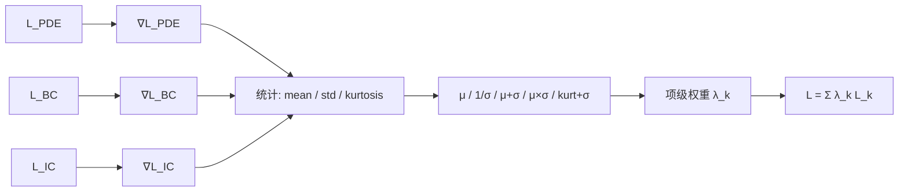
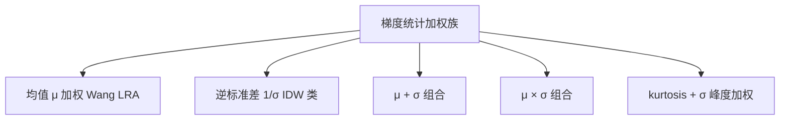

---
tags:
  - AI
  - PINN
  - 论文汇报
  - 自适应权重
date: 2026-06-06
paper_title: "Gradient Statistics-Based Multi-Objective Optimization in Physics-Informed Neural Networks"
venue: "Sensors"
venue_grade: "SCI"
doi: "10.3390/s23218665"
---

# GradStat-MOO：梯度统计多目标加权（Vemuri & Denzler 2023）

## 方法图示

> 从各损失项反向传播梯度提取 mean/std/kurtosis，构造多种项级权重方案。

## 元信息

- **作者 / 年份**：Sai Karthikeya Vemuri, Joachim Denzler, 2023
- **发表于**：Sensors, Vol. 23, No. 21（等级：SCI）
- **链接**：https://doi.org/10.3390/s23218665
- **引用数**：30+（梯度统计加权方法汇编）

## 核心内容

系统梳理 PINN 多目标损失中 PDE 残差、初值与边界项梯度**量级与分布差异**导致的训练失败，在已有 mean-based（Wang LRA）与 inverse-std（IDW）方案基础上，提出三种新权重：**μ+σ、μ×σ、kurtosis+σ**。通过在多个前向/逆问题 benchmark 上对比五种方案，给出不同 PDE 类型下更稳健的梯度统计选择指南。

## 创新点

1. 首次将**峰度（kurtosis）**引入 PINN 项级权重，捕捉梯度分布尖峰程度，补充均值/方差信息。
2. 统一实验框架对比五种梯度统计方案，而非单点提出一种方法。
3. 强调权重应在训练中**动态更新**，与固定 λ 手工调参形成鲜明对照。
4. 为后续 DB-PINN、ReLoBRaLo 综述中的梯度统计基线提供方法族谱。

## 相关汇报

| 汇报 | 关联理由 |
|------|----------|
| [[02-IDW-逆Dirichlet梯度方差加权]] | IDW 对应本文 inverse-std 方案；GradStat 在其上扩展 μ+σ、峰度组合，直接可消融。 |
| [[06-LRA-梯度病理学习率退火]] | Wang LRA 的 mean-based 加权是本文五种方案之一，LRA 提供机理，GradStat 做系统扩展。 |
| [[2026-06-04/03-DB-PINN-双层次平衡]] | DB-PINN inter-balancing 也用梯度均值统计，与 GradStat 的 μ 路线同源。 |
| [[2026-06-04/04-ReLoBRaLo-相对损失平衡]] | ReLoBRaLo 避开梯度统计；GradStat 证明梯度分布高阶矩仍有价值，适合正反对照。 |

## 与我研究的关联

在 2D 声波四项损失上，可并行跑 IDW（1/σ）与 kurtosis+σ 两种在线 λ，观察波前 stiff 区域是否因峰度加权获得更快收敛；实现仅需在现有 backward 后追加梯度向量统计，无需改网络结构。

## 备注

- 汇报批次：2026-06-06 第 2 次检索（16:42）

## 本地 PDF

> 暂无本地 PDF（本篇无 arXiv 预印本，仅期刊发表）。

- DOI：https://doi.org/10.3390/s23218665
