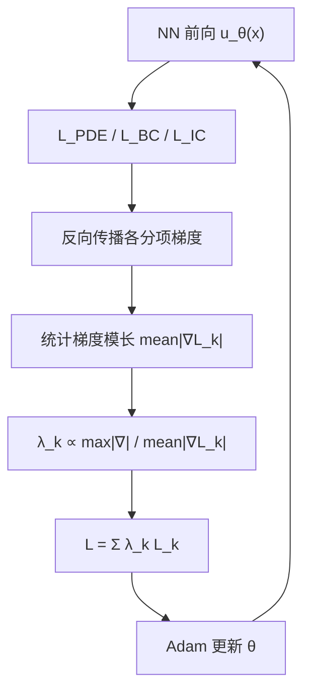
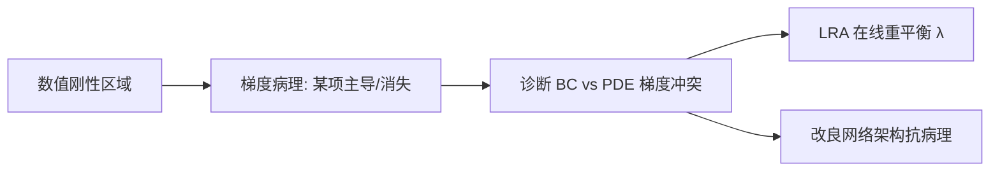

---
tags:
  - AI
  - PINN
  - 论文汇报
  - 自适应权重
date: 2026-06-06
paper_title: "Understanding and mitigating gradient flow pathologies in physics-informed neural networks"
venue: "SIAM Journal on Scientific Computing (SISC)"
venue_grade: "SCI / CCF-B(计算)"
doi: "10.1137/20M1318043"
arxiv: "2001.04536"
---

# LRA：梯度病理与学习率退火加权（Wang et al. 2021）

## 方法图示

> 诊断 PINN 多损失梯度失衡，用梯度模长统计动态调整各损失项权重（Learning Rate Annealing）。

## 元信息

- **作者 / 年份**：Sifan Wang, Yujun Teng, Paris Perdikaris, 2021
- **发表于**：SIAM Journal on Scientific Computing, Vol. 43, No. 5（等级：SCI / CCF-B）
- **链接**：https://arxiv.org/abs/2001.04536 | https://doi.org/10.1137/20M1318043
- **引用数**：1000+（PINN 梯度病理奠基文献，开源 GradientPathologiesPINNs）

## 核心内容

揭示 PINN 训练失败的**梯度流病理（gradient flow pathologies）**：数值刚性导致 PDE 残差、边界/初值各损失项反向传播梯度量级悬殊，优化陷入局部停滞。提出 **Learning Rate Annealing（LRA）**：每步用各损失项梯度模长的均值比值动态设置 λ，使各分项对参数更新的有效学习率相当；并设计更抗病理的网络结构，在多种计算物理问题上相对 vanilla PINN 精度提升 50–100×。

## 创新点

1. 首次系统命名并实验验证 PINN **梯度病理**现象，影响后续 NTK、ConFIG、DB-PINN 等全系列权重工作。
2. LRA 仅需梯度模长统计，是后来 Wang JCP NTK 加权与 ReLoBRaLo 综述中 LR Annealing 基线的**原始出处**。
3. 同时从架构侧缓解病理，提供「损失加权 + 结构」双路径。
4. 开源代码与数据，成为 PINN 训练诊断的标准参考实现。

## 相关汇报

| 汇报 | 关联理由 |
|------|----------|
| [[2026-06-04/05-NTK-特征值加权]] | 同作者 Wang 系列：LRA 是经验梯度模长加权，NTK 给出特征值理论解释，应串联阅读。 |
| [[2026-06-04/04-ReLoBRaLo-相对损失平衡]] | ReLoBRaLo 论文将 LRA 列为三大基线之一；LRA 看梯度模长，ReLoBRaLo 看损失进展率。 |
| [[05-GradStat-梯度统计多目标]] | GradStat 将 LRA 的 mean-based 方案纳入五类梯度统计族，LRA 为其理论源头。 |
| [[02-IDW-逆Dirichlet梯度方差加权]] | LRA 用梯度**模长均值**，IDW 用梯度**方差**；同属梯度统计项级加权，统计量不同。 |
| [[2026-06-05/04-ConFIG-无冲突梯度训练]] | ConFIG 从梯度冲突几何角度解决病理，LRA 从损失权重尺度角度，问题同源解法互补。 |

## 与我研究的关联

LRA 是改动最小的「第一项自适应权重」基线：在 `trainers.py` 每 N 步统计四项损失对 θ 的梯度 L2 范数，按 Wang 公式更新 λ，再与现有固定 λ 预训练流程对比，可快速判断你的 2D 声波任务是否属于梯度病理主导失败。

## 备注

- 汇报批次：2026-06-06 第 2 次检索（16:42）

## 本地 PDF

![[2001.04536.pdf]]

- arXiv：https://arxiv.org/abs/2001.04536
- 文件：`每日论文/2026-06-06/2001.04536.pdf`
