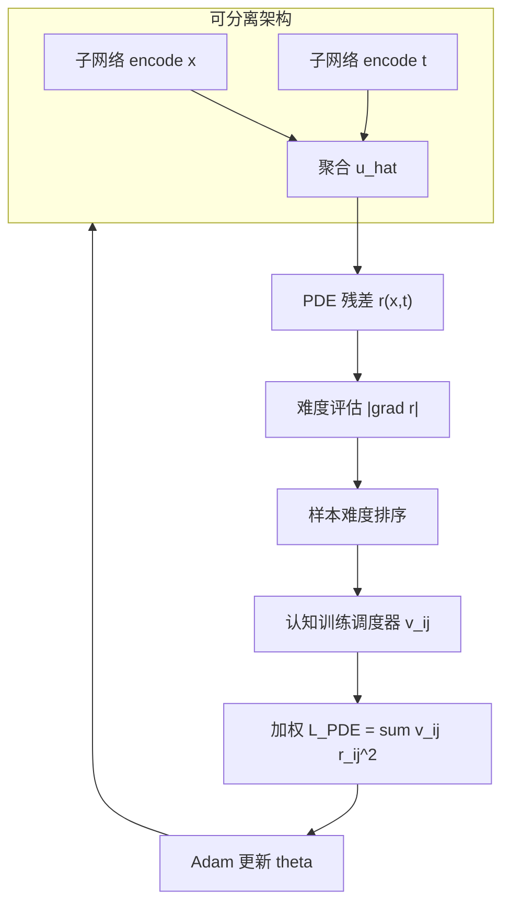
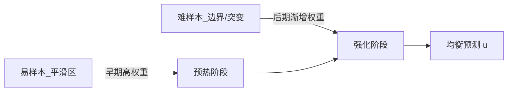

---
tags:
  - AI
  - PINN
  - 论文汇报
  - 自适应权重
date: 2026-06-07
paper_title: "CoPINN: Cognitive Physics-Informed Neural Networks"
venue: "ICML 2025"
venue_grade: "CCF-A"
doi: ""
arxiv: ""
---

# CoPINN：认知式由易到难课程训练（Duan et al. 2025）

## 方法图示

> 将 Self-Paced Learning 引入 PINN：按 PDE 残差梯度评估样本难度，课程调度器逐步加大难样本权重。

## 元信息

- **作者 / 年份**：Siyuan Duan, Wenyuan Wu, Peng Hu, Zhenwen Ren, Dezhong Peng, Yuan Sun, 2025
- **发表于**：ICML 2025（Spotlight，等级：CCF-A）
- **链接**：https://proceedings.mlr.press/v267/duan25b.html | https://openreview.net/forum?id=4vAa0A98xI | https://github.com/siyuancncnd/CoPINN
- **引用数**：待查（2025 新发表）

## 核心内容

CoPINN 揭示 PINN 中普遍存在的 **Unbalanced Prediction Problem（UPP）**：边界/突变区样本学习难度远高于平滑区，但 vanilla PINN 对所有配点一视同仁，易陷入局部最优。方法借鉴人类认知学习，用 **PDE 残差梯度模长** 度量逐点难度，再通过 **认知训练调度器** 在 epoch 内由易到难调整配点权重 \(v_{ij}\)（含 epoch 退火项 \(\tau_e\) 与样本排序项 \(\beta\delta_{ij}\)），并配合可分离子网络降低高维计算量。在 Helmholtz、Klein-Gordon 等多突变 PDE 上 RL2 可较 SPINN 等方法提升约 98%。

## 创新点

1. 首次将 Self-Paced Learning（SPL）系统引入 PINN，提出 UPP 问题定义与诊断。
2. 用 PDE 残差 **梯度**（而非仅损失值）作为物理感知的难度度量，优于传统 SPL 启发式。
3. 认知调度器双组分设计（epoch 变化 + 样本排序），避免仅关注难样本导致「遗忘」易样本。
4. 可分离坐标编码 + 聚合架构，与课程权重联合提升边界区泛化。

## 相关汇报

| 汇报 | 关联理由 |
|------|----------|
| [[2026-06-04/12-NeurIPS-失败模式与课程学习]] | 同为 **课程式训练** 应对 PINN 病态损失；NeurIPS 从时间因果扩展约束，CoPINN 从空间难度排序加权，可组合实验。 |
| [[2026-06-04/09-因果训练加权]] | 均按训练进度动态调整配点/时段权重；因果训练沿时间轴，CoPINN 沿难度轴，方法论平行。 |
| [[2026-06-04/01-BRDR-平衡残差衰减率]] | BRDR 用残差衰减率做点级权重，CoPINN 用残差梯度做难度排序；同属 **点级自适应**，可对比「衰减率 vs 梯度难度」。 |
| [[2026-06-05/02-SA-PINN-极小极大点级权重]] | SA-PINN 极小极大逐点权重，CoPINN 课程式逐点权重；可对比 saddle-point 与 easy-to-hard 调度。 |
| [[02-lbPINNs-高斯MLE项级权重]] | 今日另一篇：lbPINNs 做 **项级** 高斯 MLE 平衡，CoPINN 做 **点级** 课程权重；可联合「项间 + 点间」双层调度。 |

## 与我研究的关联

2D 声波正演中源区/边界/波前属于高梯度难样本，可将 CoPINN 的残差梯度难度排序嵌入现有 collocation 加权，替代均匀配点或固定 BRDR 权重；首个实验可在 `loss_pde` 上乘 CoPINN 式 \(v_{ij}\)，与 [[2026-06-04/01-BRDR-平衡残差衰减率]] 做点级消融。

## 备注

- 汇报批次：2026-06-07 第 1 次触发（浅海三文鱼）
- ICML 2025 正式版无 arXiv 预印本编号

## 本地 PDF

> 暂无本地 PDF（本篇无 arXiv 预印本，仅 ICML 2025 会议发表）。

- OpenReview：https://openreview.net/forum?id=4vAa0A98xI
- PMLR：https://proceedings.mlr.press/v267/duan25b.html
