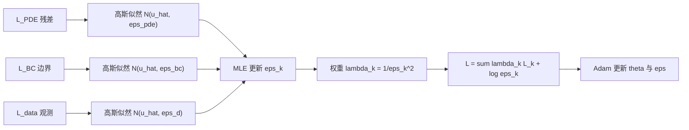
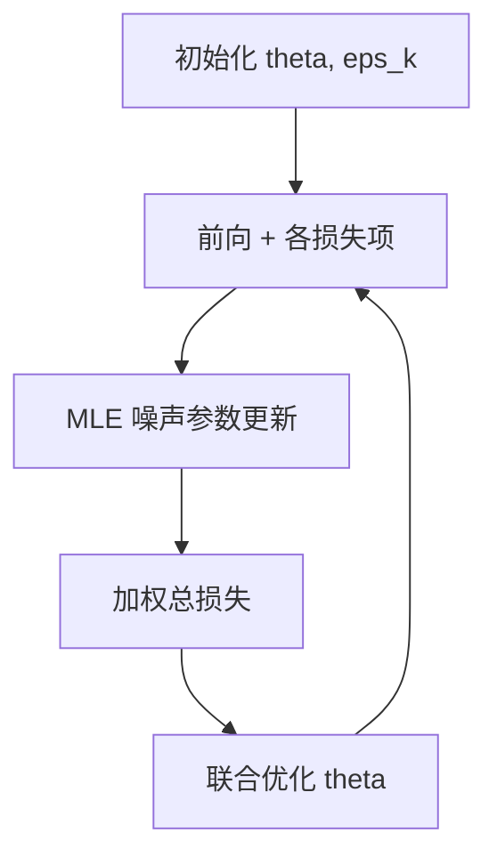

---
tags:
  - AI
  - PINN
  - 论文汇报
  - 自适应权重
date: 2026-06-07
paper_title: "Self-adaptive loss balanced Physics-informed neural networks"
venue: "Neurocomputing"
venue_grade: "CCF-B / SCI"
doi: "10.1016/j.neucom.2022.05.015"
arxiv: "2104.06217"
---

# lbPINNs：高斯似然 + MLE 自适应项级权重（Xiang et al. 2022）

## 方法图示

> 借鉴 Kendall 多任务不确定性加权：每项损失对应可学习噪声参数 ε_k，权重 λ_k ∝ 1/ε_k²，MLE 每 epoch 更新。

## 元信息

- **作者 / 年份**：Zixue Xiang, Wei Peng, Xu Liu, Wen Yao, 2022
- **发表于**：Neurocomputing, Vol. 496, pp. 11–34（等级：CCF-B / SCI）
- **链接**：https://doi.org/10.1016/j.neucom.2022.05.015 | https://arxiv.org/abs/2104.06217
- **引用数**：约 420+（Crossref，2026-06）

## 核心内容

lbPINNs 将 PINN 多损失训练视为 **多任务学习**，为每项损失（PDE 残差、边界/初值、数据拟合）建立 **高斯概率模型**，噪声参数 \(\varepsilon_k\) 即任务不确定性，对应权重 \(\lambda_k \propto 1/\varepsilon_k^2\)。每 epoch 用 **最大似然估计（MLE）** 自动更新 \(\varepsilon_k\)，无需手工调 λ。原论文以不可压 Navier-Stokes（Kovasznay、圆柱尾流、Beltrami）为主；扩展实验覆盖 Poisson、Burgers、Helmholtz、Allen-Cahn 等，相对 vanilla PINN 相对 L2 误差约降 **两个数量级**（\(10^{-2}\) → \(10^{-4}\) 量级）。

## 创新点

1. 将 Kendall et al. 不确定性加权 **系统化移植到 PINN**，赋予 λ 统计解释（逆噪声方差）。
2. MLE 在线更新，与 Adam 联合训练，计算开销低。
3. 对初始噪声参数不敏感，鲁棒性优于固定权重网格搜索。
4. 方法通用，不限于流体；为后续 BPINN、APINN 等项级方法提供早期基线。

## 相关汇报

| 汇报 | 关联理由 |
|------|----------|
| [[2026-06-04/11-BPINN-贝叶斯自适应加权]] | 同为 **概率/贝叶斯视角** 的自适应项权；BPINN 用 Pareto 后验采样，lbPINNs 用高斯 MLE，可对比贝叶斯 vs 点估计。 |
| [[2026-06-06/01-APINN-多任务自适应加权]] | 均将 PINN 视为 MTL；APINN 用损失量级平衡，lbPINNs 用高斯噪声 MLE，方法论同源不同实现。 |
| [[2026-06-04/04-ReLoBRaLo-相对损失平衡]] | ReLoBRaLo 用损失比率 + 随机回看，lbPINNs 用 MLE 噪声；CMAME 2025 综述将二者并列为项级平衡代表。 |
| [[03-I-PINN-有界不确定性加权]] | I-PINN 在 Kendall 式加权上加 **上界约束** 防权重塌陷；可视为 lbPINNs/IAW 的改进线。 |
| [[01-CoPINN-认知课程学习]] | lbPINNs 平衡 **损失项**，CoPINN 调度 **配点难度**；可组合双层自适应。 |

## 与我研究的关联

你的四项损失（PDE/快照/边界/初值）可直接为每项引入可学习 \(\log\varepsilon_k\)，用 lbPINNs 公式替换固定 λ 与 `balance_loss_scales` 预训练；与 [[2026-06-04/04-ReLoBRaLo-相对损失平衡]] 在 2D 声波上做项级消融，实现成本低（仅增 4 个标量参数）。

## 备注

- 汇报批次：2026-06-07 第 1 次触发（浅海三文鱼）
- arXiv 初稿侧重 NS 方程，Neurocomputing 正式版扩展至更多 PDE

## 本地 PDF

![[2104.06217.pdf]]

- arXiv：https://arxiv.org/abs/2104.06217
- 文件：`每日论文/2026-06-07/2104.06217.pdf`
