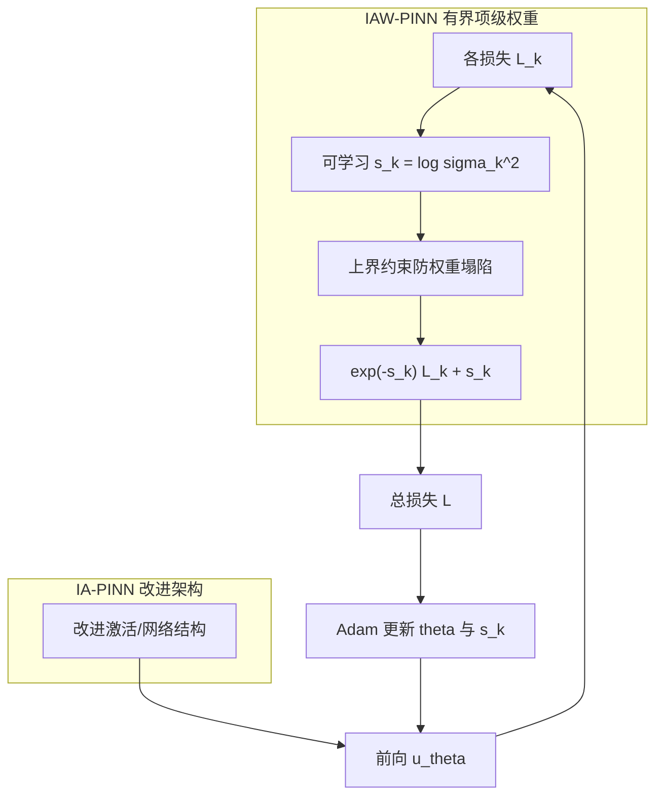
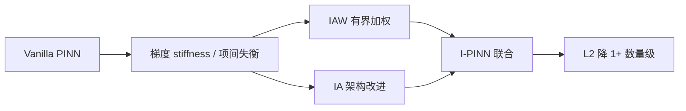

---
tags:
  - AI
  - PINN
  - 论文汇报
  - 自适应权重
date: 2026-06-07
paper_title: "Improved physics-informed neural network in mitigating gradient-related failures"
venue: "Neurocomputing"
venue_grade: "CCF-B / SCI"
doi: "10.1016/j.neucom.2025.130167"
arxiv: "2407.19421"
---

# I-PINN：有界不确定性加权 + 改进架构（Niu et al. 2025）

## 方法图示

> 融合 IA-PINN（改进激活/架构）与 IAW-PINN（带上界的 Kendall 式项级加权），缓解梯度流 stiffness。

## 元信息

- **作者 / 年份**：Pancheng Niu, Jun Guo, Yongming Chen, Yuqian Zhou, Minfu Feng, Yanchao Shi, 2025
- **发表于**：Neurocomputing, Vol. 638, 130167（等级：CCF-B / SCI）
- **链接**：https://doi.org/10.1016/j.neucom.2025.130167 | https://arxiv.org/abs/2407.19421 | https://github.com/PanChengN/I-PINN
- **引用数**：待查（2025 新发表）

## 核心内容

I-PINN 针对 PINN **梯度流 stiffness** 与多目标损失失衡，将 **改进网络架构（IA-PINN）** 与 **带上界的不确定性加权（IAW-PINN）** 联合。IAW 在 Kendall 式 \(e^{-s_k}L_k + s_k\) 上对自适应权重设 **上界**，防止残差项权重被过度抑制导致病态优化。多 benchmark 上相对 vanilla PINN、IAW-PINN、IA-PINN 单独使用，精度提升 **至少一个数量级**，且不增加相对 baseline 的计算复杂度。

## 创新点

1. 诊断无界不确定性加权导致 residual 权重塌陷的问题，提出 **有界 IAW** 约束。
2. 架构改进与损失加权 **正交组合**（I-PINN），证明二者协同优于单一路线。
3. 保持与标准 PINN 相同的计算图复杂度，便于工程替换。
4. 开源代码与多 PDE benchmark，可复现性强。

## 相关汇报

| 汇报 | 关联理由 |
|------|----------|
| [[02-lbPINNs-高斯MLE项级权重]] | 同为 Kendall/高斯路线的 **项级自适应 λ**；lbPINNs 用 MLE 噪声，I-PINN 用有界 log-variance，直接进化关系。 |
| [[2026-06-06/06-LRA-梯度病理学习率退火]] | 均针对 **梯度 pathology/stiffness**；LRA 用学习率退火 + 梯度统计，I-PINN 用有界加权 + 架构，可组合对照。 |
| [[2026-06-04/05-NTK-特征值加权]] | NTK 从核特征值平衡训练速率，I-PINN 从损失加权与架构缓解 stiffness，问题机理互补。 |
| [[2026-06-05/03-gPINN-梯度增强损失]] | gPINN 在损失中加入梯度残差项，I-PINN 从权重上界与架构入手；均属梯度相关改进，可对比「加项 vs 加权」。 |
| [[2026-06-06/01-APINN-多任务自适应加权]] | APINN 与 IAW 均为 MTL 项级平衡；I-PINN 额外强调 **权重上界** 与架构，可作 APINN+上界 消融。 |

## 与我研究的关联

在现有 2D 声波 PINN 的 `losses.py` 四项损失上，为每项引入 \(s_k\) 并加上界 \(s_k \leq s_{\max}\)，可与 [[02-lbPINNs-高斯MLE项级权重]] 的无界 MLE 做对照；若 stiffness 仍存，再叠加 [[2026-06-06/06-LRA-梯度病理学习率退火]] 的 λ 预训练初始化 \(s_k\)。

## 备注

- 汇报批次：2026-06-07 第 1 次触发（浅海三文鱼）

## 本地 PDF

![[2407.19421.pdf]]

- arXiv：https://arxiv.org/abs/2407.19421
- 文件：`每日论文/2026-06-07/2407.19421.pdf`
