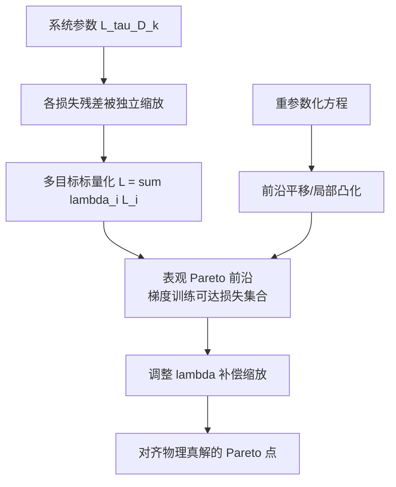
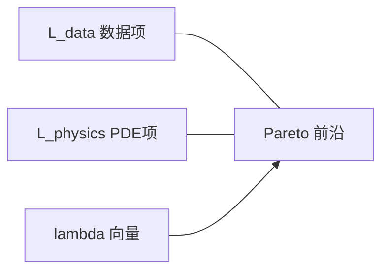

---
tags:
  - AI
  - PINN
  - 论文汇报
  - 自适应权重
date: 2026-06-08
paper_title: "Data vs. Physics: The Apparent Pareto Front of Physics-Informed Neural Networks"
venue: "IEEE Access"
venue_grade: "SCI"
doi: "10.1109/ACCESS.2023.3302892"
arxiv: "2105.00862"
---

# ParetoFront：系统参数缩放与 PINN 损失权重（Rohrhofer et al. 2023）

## 方法图示

> 从多目标优化视角：物理系统参数（特征长度/时间尺度、域大小、方程系数）单独缩放各损失残差，形成「表观 Pareto 前沿」；手工 λ 相当于在 MOO 标量化曲线上选点。

## 元信息

- **作者 / 年份**：Franz M. Rohrhofer, Stefan Posch, Clemens Gößnitzer, Bernhard C. Geiger, 2023
- **发表于**：IEEE Access, Vol. 11, pp. 86252–86261（等级：SCI）
- **链接**：https://doi.org/10.1109/ACCESS.2023.3302892 | https://arxiv.org/abs/2105.00862
- **引用数**：约 150+（Semantic Scholar，2026-06）

## 核心内容

PINN 将数据拟合与 PDE 残差通过标量化多目标损失合并，但 **系统参数**（特征时间/长度尺度、计算域、方程系数）会 **单独缩放** 各损失项，导致 MOO 严重失衡。作者定义 **表观 Pareto 前沿（apparent Pareto front）** 为梯度训练实际可达的损失组合集合，并可视化其与物理真解的偏差。实验表明：适当 **损失权重** 可补偿系统参数引起的缩放；**重参数化 PDE** 可平移前沿并产生局部凸区域，从而扩大成功训练的 λ 可行域。

## 创新点

1. 首次从 **系统参数 → 残差缩放 → MOO 失衡** 给出 PINN 调权困难的理论解释。
2. 引入 **表观 Pareto 前沿** 概念，将手工调 λ 与多目标权衡可视化挂钩。
3. 证明 **重参数化** 与 **权重补偿** 可联合改善训练成功域。
4. 为后续 Pareto/MOO 自适应加权（MOO-VARI、BPINN 等）提供问题建模基础。

## 相关汇报

| 汇报 | 关联理由 |
|------|----------|
| [[2026-06-04/08-MOO-VARI-多目标优化加权]] | MOO-VARI 用 NSGA-II 探索 Pareto 前沿并转 VARI 权重；本篇从 **系统参数** 解释前沿形状，二者互补「为何 MOO」与「如何搜前沿」。 |
| [[2026-06-04/11-BPINN-贝叶斯自适应加权]] | BPINN 在后验空间做 Pareto 探索调权；本篇的表观前沿是 **确定性梯度训练** 下的 MOO 几何解释。 |
| [[2026-06-04/04-ReLoBRaLo-相对损失平衡]] | ReLoBRaLo 在线平衡项级损失；本篇说明 **固定 λ 失败** 常与系统尺度有关，而非仅优化算法。 |
| [[2026-06-04/05-NTK-特征值加权]] | NTK 从核谱解释 stiff；本篇从 **方程参数化/尺度** 解释 stiff，属 MOO 与 NTK 两条理论线。 |
| [[02-OptimalWeight-相对误差最优缩放]] | van der Meer 给出 **解析最优缩放**；本篇给出 **几何/前沿** 视角，可联合指导 λ 初值与可行域分析。 |

## 与我研究的关联

2D 声波正演中波速、频率、域尺寸会改变 PDE 残差与边界/快照项的量级比；可按本篇思路 **绘制训练过程中 (L_pde, L_bc, L_data) 轨迹** 对照表观前沿，再决定 ReLoBRaLo/lbPINNs 的 λ 初值或是否需 **无量纲化重参数化**。

## 备注

- 汇报批次：2026-06-08 第 1 次触发（浅海三文鱼）
- 预印本 2021，IEEE Access 正式版 2023

## 本地 PDF

![[2105.00862.pdf]]

- arXiv：https://arxiv.org/abs/2105.00862
- 文件：`每日论文/2026-06-08/2105.00862.pdf`
