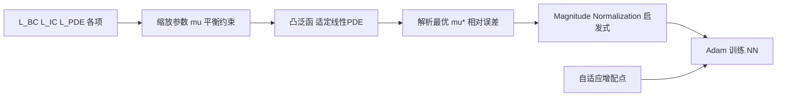
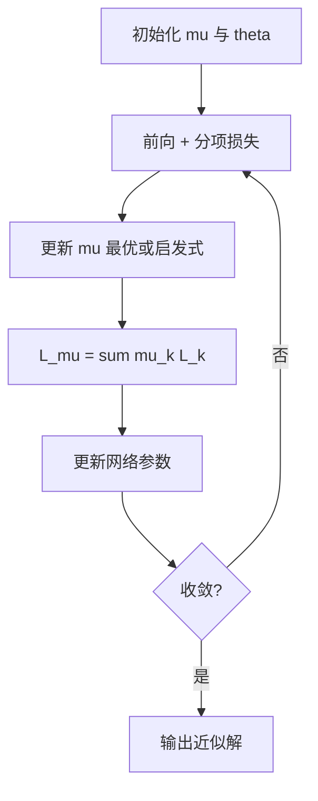

---
tags:
  - AI
  - PINN
  - 论文汇报
  - 自适应权重
date: 2026-06-08
paper_title: "Optimally weighted loss functions for solving PDEs with Neural Networks"
venue: "Journal of Computational and Applied Mathematics"
venue_grade: "SCI"
doi: "10.1016/j.cam.2021.113887"
arxiv: "2002.06269"
---

# OptimalWeight：相对误差最优的损失缩放参数（van der Meer et al. 2022）

## 方法图示

> 在线性适定 PDE 下，带缩放参数 μ 的损失泛函凸；推导使 **相对 L2 误差** 最小的 μ*，无解析解时用 **Magnitude Normalization** 启发式近似。

## 元信息

- **作者 / 年份**：Remco van der Meer, Cornelis W. Oosterlee, Anastasia Borovykh, 2022
- **发表于**：Journal of Computational and Applied Mathematics, Vol. 405, 113887（等级：SCI）
- **链接**：https://doi.org/10.1016/j.cam.2021.113887 | https://arxiv.org/abs/2002.06269
- **引用数**：约 180+（Semantic Scholar，2026-06）

## 核心内容

针对 PINN 多约束损失，引入 **缩放参数 μ** 平衡 PDE 残差、边界/初值与数据项的相对重要性。对线性适定 PDE，证明加权损失关于 μ 的泛函 **凸**，并推导使 **相对误差测度** 最小的 **解析最优 μ***。因 μ* 依赖真解，作者提出 **Magnitude Normalization** 启发式，在未知解析解时近似最优缩放；配合 **自适应增加配点**，在 Poisson、对流扩散（含边界层）、高维 PDE 上显著优于原始 PINN。

## 创新点

1. 从 **相对误差最优** 角度严格推导损失缩放，而非经验 grid search。
2. 凸性分析为 μ 的选取提供数学保证（线性适定情形）。
3. **Magnitude Normalization** 可在无真解时实用，代码开源。
4. 为 IDW、ReLoBRaLo 等后续启发式加权提供 **解析基准** 对照。

## 相关汇报

| 汇报 | 关联理由 |
|------|----------|
| [[2026-06-06/02-IDW-逆Dirichlet梯度方差加权]] | IDW 引用并对比 van der Meer 的 **ε-最优静态权重**；本篇是 IDW 论文链上的解析最优基线。 |
| [[2026-06-06/06-LRA-梯度病理学习率退火]] | LRA 用梯度统计动态调权；本篇用 **相对误差理论** 定 μ，属「解析 vs 梯度统计」对照。 |
| [[2026-06-04/04-ReLoBRaLo-相对损失平衡]] | ReLoBRaLo 用损失比率在线平衡；本篇 Optimal/Magnitude 是 **离线/每步** 的 μ 选择，可联合做初值。 |
| [[2026-06-06/01-APINN-多任务自适应加权]] | APINN 在线自适应 λ；本篇给出 **理论最优 μ*** 作为 APINN 应逼近的目标。 |
| [[01-ParetoFront-系统参数与损失权重]] | Pareto 前沿解释 **为何** μ 难选；本篇回答 **如何** 在已知结构下选最优 μ。 |

## 与我研究的关联

声波正演四项损失可先按 Magnitude Normalization 估计 μ 初值（各损失量级归一），再叠加 lbPINNs MLE 微调；对流扩散边界层实验表明 μ 对 stiff 问题关键，与源区/边界 stiff 的声波场景直接类比。

## 备注

- 汇报批次：2026-06-08 第 1 次触发（浅海三文鱼）
- 开源：https://github.com/remcovandermeer/Optimally-Weighted-PINNs

## 本地 PDF

![[2002.06269.pdf]]

- arXiv：https://arxiv.org/abs/2002.06269
- 文件：`每日论文/2026-06-08/2002.06269.pdf`
