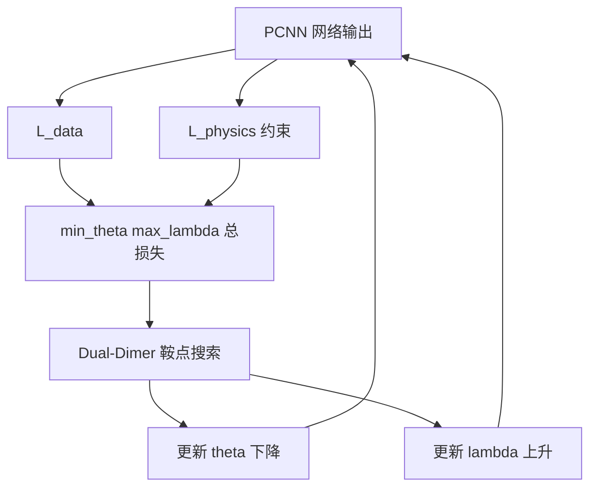

---
tags:
  - AI
  - PINN
  - 论文汇报
  - 自适应权重
date: 2026-06-08
paper_title: "A Dual-Dimer method for training physics-constrained neural networks with minimax architecture"
venue: "Neural Networks"
venue_grade: "CCF-B / SCI"
doi: "10.1016/j.neunet.2021.01.021"
arxiv: "2005.00615"
---

# PCNN-MM：Dual-Dimer minimax 架构系统化损失权重（Liu & Wang 2021）

## 方法图示

> 将 PCNN 训练改为 minimax：网络参数 θ 最小化、损失权重 λ 最大化（惩罚系数），Dual-Dimer 算法搜索高阶鞍点，避免 GDA 在非凸-非凹目标上的震荡。

## 元信息

- **作者 / 年份**：Dehao Liu, Yan Wang, 2021
- **发表于**：Neural Networks, Vol. 136, pp. 112–125（等级：CCF-B / SCI）
- **链接**：https://doi.org/10.1016/j.neunet.2021.01.021 | https://arxiv.org/abs/2005.00615
- **引用数**：约 100+（Google Scholar，2026-06）

## 核心内容

Physics-Constrained Neural Networks（PCNN，PINN 前身之一）中数据项与物理约束项权重通常 **手工设定**。Liu & Wang 提出 **PCNN-MM（minimax 架构）**：将训练表述为 **min_θ max_λ** 的 minimax 问题，λ 作为可学习的惩罚系数在训练中 **系统化调整**，而非 grid search。针对 resulting 非凸-非凹目标，提出 **Dual-Dimer** 鞍点搜索算法（仅需一阶导），比标准 gradient descent-ascent 更高效，并提供特征值信息验证鞍点质量。在多保真、稀疏数据场景下验证收敛与精度提升。

## 创新点

1. 首次将 PINN/PCNN 多损失权重调整 **形式化为 minimax**，λ 与 θ 联合优化。
2. **Dual-Dimer** 专为非凸-非凹鞍点设计，克服 GDA 不稳定。
3. 为后续 SA-PINN（点级 minimax）、AL-PINN（乘子）等 **对偶/鞍点** 方法奠基。
4. 权重更新与 **残差正比上升** 的 penalty 思想一致，与 Liu & Wang 后续工作及 McClenny SA-PINN 一脉相承。

## 相关汇报

| 汇报 | 关联理由 |
|------|----------|
| [[2026-06-05/02-SA-PINN-极小极大点级权重]] | SA-PINN 将 minimax 扩展到 **逐点权重**；本篇是 **项级 minimax** 奠基作，McClenny 明确引用 Liu & Wang penalty 思路。 |
| [[2026-06-04/07-AL-PINN-增广拉格朗日]] | AL-PINN 用增广拉格朗日乘子替代手工 λ；本篇与 ALM 同属 **约束优化/对偶** 框架，可对比 minimax vs ALM。 |
| [[2026-06-05/06-PD-PINN-原始对偶鲁棒训练]] | PD-PINN 用原始-对偶上升；本篇 Dual-Dimer 也是 **鞍点搜索**，方法论相邻。 |
| [[2026-06-04/04-ReLoBRaLo-相对损失平衡]] | ReLoBRaLo 标量化 MOO；本篇用 minimax 避免手工 λ，属 **对偶 vs 标量化** 两条线。 |
| [[02-OptimalWeight-相对误差最优缩放]] | van der Meer 解析最优 μ；本篇 **在线 max λ** 自适应，可对比静态最优 vs 动态 minimax。 |

## 与我研究的关联

可将声波正演四项损失的标量权重改为 **可学习 λ_k**，用 minimax（θ 降、λ 升）或简化版 GDA 替代固定 λ；难点是非凸-非凹时建议先用 Dual-Dimer 思想或小步长 λ 更新，并与 SA-PINN 点级权重做项级/点级消融。

## 备注

- 汇报批次：2026-06-08 第 1 次触发（浅海三文鱼）
- PCNN 为 PINN 早期命名，物理约束结构与现代 PINN 一致

## 本地 PDF

![[2005.00615.pdf]]

- arXiv：https://arxiv.org/abs/2005.00615
- 文件：`每日论文/2026-06-08/2005.00615.pdf`
