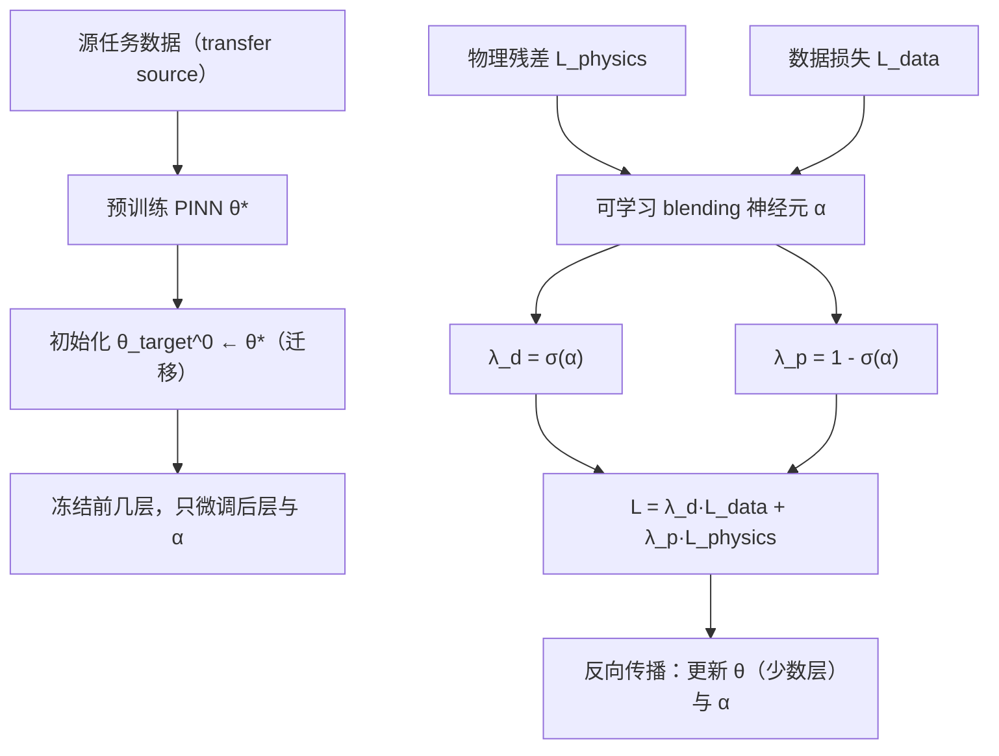

---
tags:
  - AI
  - PINN
  - 论文汇报
  - 自适应权重
date: 2026-06-08
paper_title: "Physics-Informed Neural Networks with Learnable Loss Balancing and Transfer Learning"
venue: "arXiv"
venue_grade: "预印本"
arxiv: "2605.05217"
---

# Physics-Informed Neural Networks with Learnable Loss Balancing and Transfer Learning

## 方法图示

## 元信息

- **作者 / 年份**：Reza Pirayeshshirazinezhad（2026）
- **发表于**：arXiv（等级：预印本）
- **链接**：https://arxiv.org/abs/2605.05217
- **引用数**：未在 arXiv abs 页面显示

## 核心内容

本文提出一个自监督的 PINN 框架，用“可学习的 blending 神经元”在训练过程中自动平衡物理残差与数据驱动监督：令 `λ_d = σ(α)`、`λ_p = 1-σ(α)`，其中 `α` 是可训练标量并通过反向传播更新。为缓解极小数据场景下的收敛不稳，作者还引入迁移学习：先在源域训练，再将参数（至少部分隐藏表征）初始化到目标域，并只对后层与 blending 参数进行微调。

## 创新点

1. **自监督可学习权重**：把物理-数据权衡系数显式化为 `α` 并用 sigmoid 映射到 `λ_d/λ_p`。
2. **与迁移学习联动**：通过 θ 的初始化与“少层微调”提升 87 点级别数据下的稳定性与泛化。
3. **小样本热传案例验证**：在液态钠微型换热器热传预测任务上，展示无需手动调参的稳定训练。

## 相关汇报

| 汇报 | 关联理由 |
|------|----------|
| [[2026-06-07/02-lbPINNs-高斯MLE项级权重]] | 两者都把“权衡系数”与（某种不确定性/可学习参数）绑定，用以自动调节物理项与数据项贡献。 |
| [[2026-06-04/04-ReLoBRaLo-相对损失平衡]] | ReLoBRaLo 用相对进展统计做损失平衡；本篇用更轻量的可学习 blending neuron 达到同类目标（减少手动权重）。 |
| [[2026-06-06/04-MultiAdam-尺度不变优化器]] | 都关注“多项损失在训练中的尺度失衡”问题，只是控制信号来自权重网络（本篇）与优化器尺度不变性（历史篇）。 |

## 与我研究的关联

2D 声波正演里，PDE 残差与观测快照损失往往量级/可学习难度差异很大；可把 blending neuron 直接挂到 `λ_pde/λ_data` 上，让权重系数随训练不确定性自适应变化，从而减少你手工调 λ 的成本。

## 备注

- 汇报批次：2026-06-08 第 2 次触发（浅海三文鱼）

## 本地 PDF

![[2605.05217.pdf]]

- arXiv：https://arxiv.org/abs/2605.05217
- 文件：`每日论文/2026-06-08/2605.05217.pdf`

