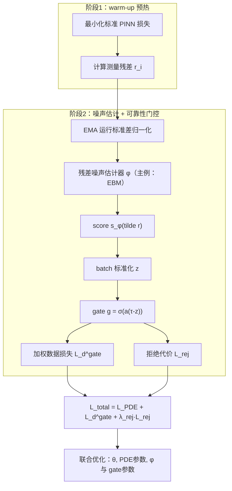

---
tags:
  - AI
  - PINN
  - 论文汇报
  - 自适应权重
date: 2026-06-08
paper_title: "naPINN: Noise-Adaptive Physics-Informed Neural Networks for Recovering Physics from Corrupted Measurement"
venue: "arXiv"
venue_grade: "预印本"
arxiv: "2602.02547"
---

# naPINN: Noise-Adaptive Physics-Informed Neural Networks for Recovering Physics from Corrupted Measurement

## 方法图示

## 元信息

- **作者 / 年份**：Hankyeol Kim, Pilsung Kang（2026）
- **发表于**：arXiv（等级：预印本）
- **链接**：https://arxiv.org/abs/2602.02547
- **引用数**：未在 arXiv abs 页面显示

## 核心内容

本文针对“观测数据被复杂噪声与离群值污染、且噪声分布未知”的逆 PINN 问题提出 naPINN：通过 residual-based noise distribution estimator 估计每个测量残差的可靠性，再由一个可训练的 reliability gate 将“不可靠样本”在数据损失中下调。为避免 gate 退化为“直接拒绝大部分数据”，作者额外引入 rejection-cost 正则项。

## 创新点

1. **测量级可靠性门控**：把数据项的权重从“固定鲁棒损失”升级为由残差可靠性驱动的自适应选择。
2. **staged 训练稳定化**：warm-up 后再初始化噪声估计器，并用 EMA 运行统计对残差归一化，提升估计与门控的收敛稳定性。
3. **噪声估计器模块化**：同一 reliability gate 框架可替换不同残差密度估计器（主例 EBM，且文中也讨论 KDE/GMM）。

## 相关汇报

| 汇报 | 关联理由 |
|------|----------|
| [[2026-06-04/13-vRBA-变分残差注意力]] | 都属于“用残差/误差信号做点级权重/注意力”的路线；区别在于 naPINN 的权重来自残差噪声分布学习与门控。 |
| [[2026-06-06/02-IDW-逆Dirichlet梯度方差加权]] | 都围绕“方差/不可靠性导致的训练失衡”进行自适应调权；一个基于梯度方差，一个基于残差噪声可靠性。 |
| [[2026-06-07/03-I-PINN-有界不确定性加权]] | 都利用不确定性结构来抑制训练失败模式；naPINN 进一步做了“测量点筛选/抑制离群值”的显式机制。 |

## 与我研究的关联

如果你的声波正演或参数反演实验来自传感器/仿真抽样，常会出现少量坏点（离群传感器读数、数值不一致）。naPINN 的 reliability gate 可以直接作为“点级自适应权重”，在不预设噪声分布的前提下提升鲁棒性与参数恢复可信度。

## 备注

- 汇报批次：2026-06-08 第 2 次触发（浅海三文鱼）

## 本地 PDF

![[2602.02547.pdf]]

- arXiv：https://arxiv.org/abs/2602.02547
- 文件：`每日论文/2026-06-08/2602.02547.pdf`

