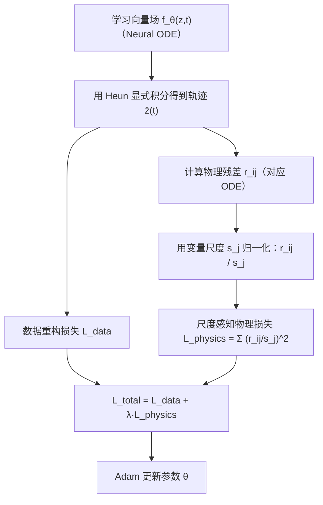

---
tags:
  - AI
  - PINN
  - 论文汇报
  - 自适应权重
date: 2026-06-08
paper_title: "Physics-Informed Neural ODEs with Scale-Aware Residuals for Learning Stiff Biophysical Dynamics"
venue: "MSML 2025"
venue_grade: "待确认"
arxiv: "2511.11734"
---

# Physics-Informed Neural ODEs with Scale-Aware Residuals for Learning Stiff Biophysical Dynamics

## 方法图示

## 元信息

- **作者 / 年份**：Kamalpreet Singh Kainth 等（2025）
- **发表于**：MSML 2025（等级：待确认）
- **链接**：https://arxiv.org/abs/2511.11734
- **引用数**：未在 arXiv abs 页面显示

## 核心内容

本文提出 PI-NODE-SR：把物理残差的计算与“尺度感知残差归一化”结合起来，用来解决刚性系统中不同状态变量演化尺度/时间尺度差异极大的问题。具体做法是：对物理残差向量的各分量按变量尺度 `s_j` 进行归一化（文中以训练窗口中导数的经验标准差作为尺度），并与低阶显式求解器 Heun 的神经 ODE 训练形成协同，从而在 Hodgkin–Huxley 刚性生物动力学上实现更稳定的长时外推。

## 创新点

1. **尺度感知残差归一化**：用 `s_j` 拉齐不同状态分量的残差尺度，避免 fast 变量主导梯度而 slow 变量消失。
2. **solver–loss 协同**：尽管 Heun 单独用于刚性问题常不稳定，但与尺度感知残差配合能恢复训练稳定性。
3. **面向刚性长时外推的可复现验证**：在 Hodgkin–Huxley 上展示频率/幅值更可靠的外推，并给出系统的消融分析。

## 相关汇报

| 汇报 | 关联理由 |
|------|----------|
| [[2026-06-06/04-MultiAdam-尺度不变优化器]] | 都在处理“多变量/多项在训练中的尺度失衡”，一个用优化器尺度不变性，一个用残差分量归一化。 |
| [[2026-06-06/06-LRA-梯度病理学习率退火]] | LRA 关注梯度病理与复合损失项的失衡；本篇把失衡建模为变量尺度差异并在残差层面消解。 |
| [[2026-06-08/02-OptimalWeight-相对误差最优缩放]] | 都涉及“基于尺度/量纲的调权或归一化”思想，用以获得更稳定的损失几何与可训练域。 |

## 与我研究的关联

2D 声波正演里（尤其是你同时建模 PDE、多类边界/快照损失时），不同损失/残差项常会呈现量级差异；PI-NODE-SR 的“分量尺度归一化”可以作为一种更结构化的 λ 设定方式，帮助你减少训练失败与长时漂移。

## 备注

- 汇报批次：2026-06-08 第 2 次触发（浅海三文鱼）

## 本地 PDF

![[2511.11734.pdf]]

- arXiv：https://arxiv.org/abs/2511.11734
- 文件：`每日论文/2026-06-08/2511.11734.pdf`

