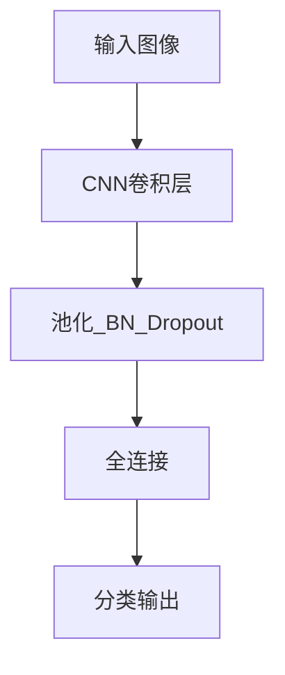

---
tags:
  - AI
  - PINN
  - 论文汇报
  - 阅读路径
date: 2026-06-09
paper_title: "Batch Normalization: Accelerating Deep Network Training"
venue: "ICML"
venue_grade: "经典"
arxiv: "1502.03167"
reading_path_order: 7
reading_path_phase: "阶段2-深度学习里程碑"
---

# Batch Normalization: Accelerating Deep Network Training

## 方法图示

## 元信息

- **作者 / 年份**：Ioffe & Szegedy / 2015
- **发表于**：ICML
- **阅读路径序号**：7（阶段2-深度学习里程碑）
- **链接**：https://arxiv.org/abs/1502.03167

## 核心内容

批归一化，训练更深网络

## 创新点

1. **阅读定位**：批归一化，训练更深网络
2. **阶段**：阶段2-深度学习里程碑 系统阅读清单第 7 篇。
3. 详见原文；本篇为阅读路径导读归档。

## 相关汇报

| 汇报 | 关联理由 |
|------|----------|
| [[AI/PINN/阅读路径/_index]] | 系统阅读路径总索引 |

## 与我研究的关联

作为 PINN 声波正演与损失自适应权重研究的**背景阅读**；阶段 4–5 与当前实验（A–F 方案、λ 平衡）直接相关。

## 备注

- 汇报批次：2026-06-09 阅读路径批量导入
- 源笔记：[[AI/PINN/阅读路径/阶段2-深度学习里程碑/07-BatchNorm]]

## 本地 PDF

![[1502.03167.pdf]]

- arXiv：https://arxiv.org/abs/1502.03167
- 文件：`每日论文/2026-06-09/1502.03167.pdf`
