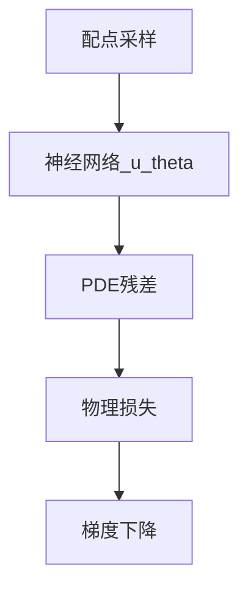

---
tags:
  - AI
  - PINN
  - 论文汇报
  - 阅读路径
date: 2026-06-09
paper_title: "DGM: Deep Galerkin Method"
venue: "PNAS"
venue_grade: "经典/奠基"
doi: "10.1073/pnas.1718945115"
arxiv: "1707.02568"
reading_path_order: 13
reading_path_phase: "阶段3-科学计算与神经PDE"
---

# DGM: Deep Galerkin Method

## 方法图示

## 元信息

- **作者 / 年份**：Han, Jentzen & E / 2018
- **发表于**：PNAS
- **阅读路径序号**：13（阶段3-科学计算与神经PDE）
- **链接**：https://arxiv.org/abs/1707.02568

## 核心内容

另一种神经 PDE 思路，便于对比

## 创新点

1. **阅读定位**：另一种神经 PDE 思路，便于对比
2. **阶段**：阶段3-科学计算与神经PDE 系统阅读清单第 13 篇。
3. 详见原文；本篇为阅读路径导读归档。

## 相关汇报

| 汇报 | 关联理由 |
|------|----------|
| [[AI/PINN/阅读路径/_index]] | 系统阅读路径总索引 |

## 与我研究的关联

作为 PINN 声波正演与损失自适应权重研究的**背景阅读**；阶段 4–5 与当前实验（A–F 方案、λ 平衡）直接相关。

## 备注

- 汇报批次：2026-06-09 阅读路径批量导入
- 源笔记：[[AI/PINN/阅读路径/阶段3-科学计算与神经PDE/13-DGM]]

## 本地 PDF

![[1707.02568.pdf]]

- arXiv：https://arxiv.org/abs/1707.02568
- 文件：`每日论文/2026-06-09/1707.02568.pdf`
