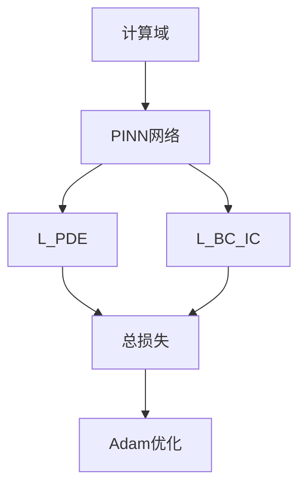

---
tags:
  - AI
  - PINN
  - 论文汇报
  - 阅读路径
date: 2026-06-09
paper_title: "Physics-informed neural networks: A deep learning framework for solving forward and inverse problems involving nonlinear partial differential equations"
venue: "JCP"
venue_grade: "SCI一区"
doi: "10.1016/j.jcp.2018.10.045"
reading_path_order: 15
reading_path_phase: "阶段4-PINN核心与经典"
---

# Physics-informed neural networks: A deep learning framewo...

## 方法图示

## 元信息

- **作者 / 年份**：Raissi, Perdikaris & Karniadakis / 2019
- **发表于**：JCP
- **阅读路径序号**：15（阶段4-PINN核心与经典）
- **链接**：https://doi.org/10.1016/j.jcp.2018.10.045

## 核心内容

PINN 奠基之作，损失、边界、逆问题

## 创新点

1. **阅读定位**：PINN 奠基之作，损失、边界、逆问题
2. **阶段**：阶段4-PINN核心与经典 系统阅读清单第 15 篇。
3. 详见原文；本篇为阅读路径导读归档。

## 相关汇报

| 汇报 | 关联理由 |
|------|----------|
| [[2026-06-04/01-BRDR-平衡残差衰减率]] | 同一论文或同主题已有深度日报 |

## 与我研究的关联

作为 PINN 声波正演与损失自适应权重研究的**背景阅读**；阶段 4–5 与当前实验（A–F 方案、λ 平衡）直接相关。

## 备注

- 汇报批次：2026-06-09 阅读路径批量导入
- 源笔记：[[AI/PINN/阅读路径/阶段4-PINN核心与经典/15-PINN奠基]]

## 本地 PDF

> 暂无 arXiv 预印本；使用 DOI 或已下载非 arXiv PDF。

- DOI：https://doi.org/10.1016/j.jcp.2018.10.045
- 本地副本：`每日论文/2026-06-09/raissi-pinn-jcp-2019.pdf`
