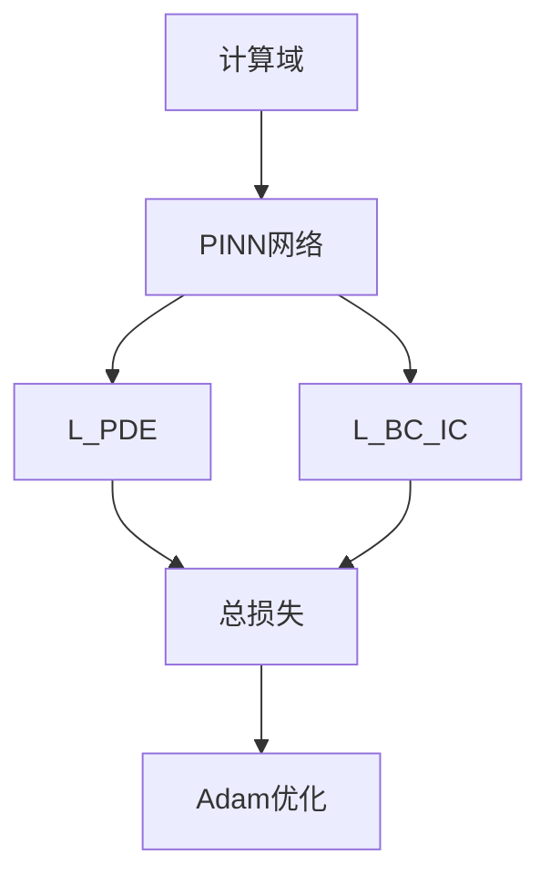

---
tags:
  - AI
  - PINN
  - 论文汇报
  - 阅读路径
date: 2026-06-09
paper_title: "Extended Physics-Informed Neural Networks (XPINN)"
venue: "CMAME"
venue_grade: "经典/奠基"
doi: "10.1016/j.cma.2020.113028"
arxiv: "1911.00534"
reading_path_order: 16
reading_path_phase: "阶段4-PINN核心与经典"
---

# Extended Physics-Informed Neural Networks (XPINN)

## 方法图示

## 元信息

- **作者 / 年份**：Jagtap, Kawaguchi & Karniadakis / 2020
- **发表于**：CMAME
- **阅读路径序号**：16（阶段4-PINN核心与经典）
- **链接**：https://arxiv.org/abs/1911.00534

## 核心内容

域分解、复杂几何

## 创新点

1. **阅读定位**：域分解、复杂几何
2. **阶段**：阶段4-PINN核心与经典 系统阅读清单第 16 篇。
3. 详见原文；本篇为阅读路径导读归档。

## 相关汇报

| 汇报 | 关联理由 |
|------|----------|
| [[AI/PINN/阅读路径/_index]] | 系统阅读路径总索引 |

## 与我研究的关联

作为 PINN 声波正演与损失自适应权重研究的**背景阅读**；阶段 4–5 与当前实验（A–F 方案、λ 平衡）直接相关。

## 备注

- 汇报批次：2026-06-09 阅读路径批量导入
- 源笔记：[[AI/PINN/阅读路径/阶段4-PINN核心与经典/16-XPINN]]

## 本地 PDF

![[1911.00534.pdf]]

- arXiv：https://arxiv.org/abs/1911.00534
- 文件：`每日论文/2026-06-09/1911.00534.pdf`
