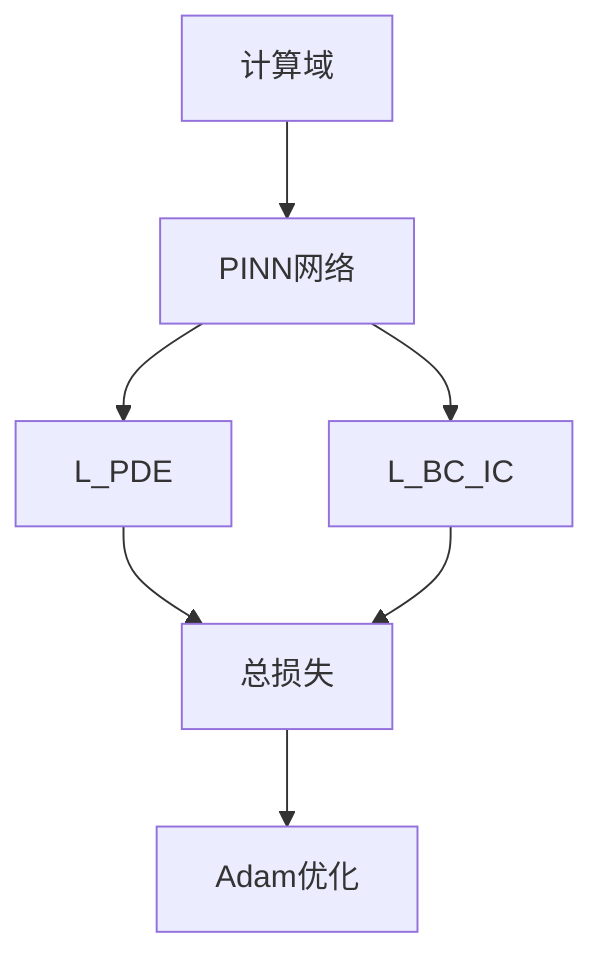

---
tags:
  - AI
  - PINN
  - 论文汇报
  - 阅读路径
date: 2026-06-09
paper_title: "When and why PINNs fail to train: A neural tangent kernel perspective"
venue: "JCP"
venue_grade: "SCI一区"
doi: "10.1016/j.jcp.2022.01.023"
arxiv: "2007.14527"
reading_path_order: 19
reading_path_phase: "阶段4-PINN核心与经典"
---

# When and why PINNs fail to train: A neural tangent kernel...

## 方法图示

## 元信息

- **作者 / 年份**：Wang, Yu & Perdikaris / 2022
- **发表于**：JCP
- **阅读路径序号**：19（阶段4-PINN核心与经典）
- **链接**：https://arxiv.org/abs/2007.14527

## 核心内容

训练失败机理，NTK 视角

## 创新点

1. **阅读定位**：训练失败机理，NTK 视角
2. **阶段**：阶段4-PINN核心与经典 系统阅读清单第 19 篇。
3. 详见原文；本篇为阅读路径导读归档。

## 相关汇报

| 汇报 | 关联理由 |
|------|----------|
| [[每日论文/2026-06-04/05-NTK-特征值加权]] | 同一论文或同主题已有深度日报 |

## 与我研究的关联

作为 PINN 声波正演与损失自适应权重研究的**背景阅读**；阶段 4–5 与当前实验（A–F 方案、λ 平衡）直接相关。

## 备注

- 汇报批次：2026-06-09 阅读路径批量导入
- 源笔记：[[AI/PINN/阅读路径/阶段4-PINN核心与经典/19-NTK失败机理]]

## 本地 PDF

![[2007.14527.pdf]]

- arXiv：https://arxiv.org/abs/2007.14527
- 文件：`每日论文/2026-06-09/2007.14527.pdf`
