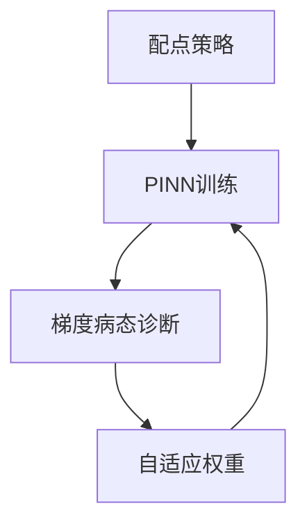

---
tags:
  - AI
  - PINN
  - 论文汇报
  - 阅读路径
date: 2026-06-09
paper_title: "Learning the solution operator of parametric partial differential equations with physics-informed DeepONets"
venue: "Science Advances"
venue_grade: "SCI"
doi: "10.1126/sciadv.abi8605"
arxiv: "2103.10974"
reading_path_order: 22
reading_path_phase: "阶段5-PINN进阶与前沿"
---

# Learning the solution operator of parametric partial diff...

## 方法图示

## 元信息

- **作者 / 年份**：Sifan Wang, Hanwen Wang & Perdikaris / 2021
- **发表于**：Science Advances
- **阅读路径序号**：22（阶段5-PINN进阶与前沿）
- **链接**：https://arxiv.org/abs/2103.10974

## 核心内容

算子学习 + 物理约束

## 创新点

1. **阅读定位**：算子学习 + 物理约束
2. **阶段**：阶段5-PINN进阶与前沿 系统阅读清单第 22 篇。
3. 详见原文；本篇为阅读路径导读归档。

## 相关汇报

| 汇报 | 关联理由 |
|------|----------|
| [[AI/PINN/阅读路径/_index]] | 系统阅读路径总索引 |

## 与我研究的关联

作为 PINN 声波正演与损失自适应权重研究的**背景阅读**；阶段 4–5 与当前实验（A–F 方案、λ 平衡）直接相关。

## 备注

- 汇报批次：2026-06-09 阅读路径批量导入
- 源笔记：[[AI/PINN/阅读路径/阶段5-PINN进阶与前沿/22-PI-DeepONet]]

## 本地 PDF

![[2103.10974.pdf]]

- arXiv：https://arxiv.org/abs/2103.10974
- 文件：`每日论文/2026-06-09/2103.10974.pdf`
