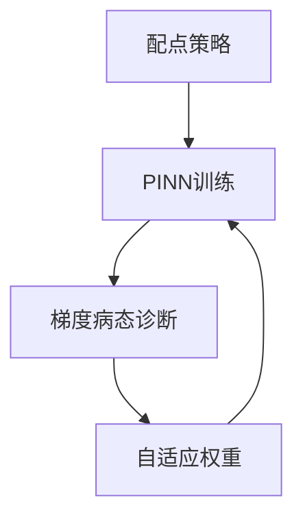

---
tags:
  - AI
  - PINN
  - 论文汇报
  - 阅读路径
date: 2026-06-09
paper_title: "A comprehensive study of non-adaptive and residual-based adaptive sampling for PINNs"
venue: "CMAME"
venue_grade: "经典/奠基"
doi: "10.1016/j.cma.2022.06.026"
arxiv: "2207.10289"
reading_path_order: 25
reading_path_phase: "阶段5-PINN进阶与前沿"
---

# A comprehensive study of non-adaptive and residual-based ...

## 方法图示

## 元信息

- **作者 / 年份**：Wu et al. / 2023
- **发表于**：CMAME
- **阅读路径序号**：25（阶段5-PINN进阶与前沿）
- **链接**：https://arxiv.org/abs/2207.10289

## 核心内容

采样策略

## 创新点

1. **阅读定位**：采样策略
2. **阶段**：阶段5-PINN进阶与前沿 系统阅读清单第 25 篇。
3. 详见原文；本篇为阅读路径导读归档。

## 相关汇报

| 汇报 | 关联理由 |
|------|----------|
| [[2026-06-06/03-BRDR-SAS-加权与采样联合]] | 同一论文或同主题已有深度日报 |

## 与我研究的关联

作为 PINN 声波正演与损失自适应权重研究的**背景阅读**；阶段 4–5 与当前实验（A–F 方案、λ 平衡）直接相关。

## 备注

- 汇报批次：2026-06-09 阅读路径批量导入
- 源笔记：[[AI/PINN/阅读路径/阶段5-PINN进阶与前沿/25-采样策略]]

## 本地 PDF

![[2207.10289.pdf]]

- arXiv：https://arxiv.org/abs/2207.10289
- 文件：`每日论文/2026-06-09/2207.10289.pdf`
