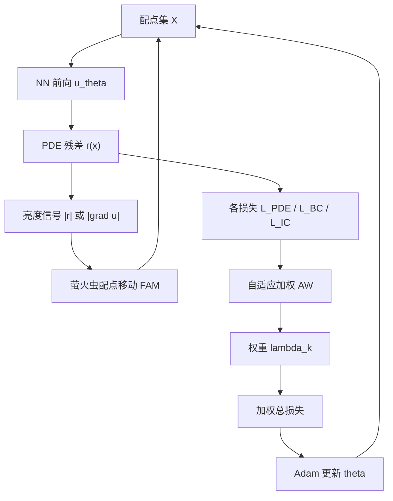
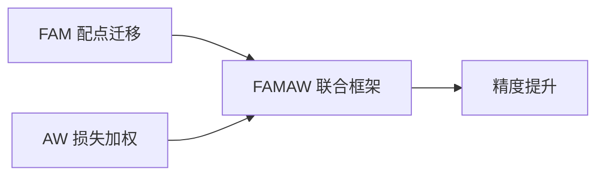

---
tags:
  - AI
  - PINN
  - 论文汇报
  - 自适应权重
date: 2026-06-10
paper_title: "FAMAW-PINN: A physics-informed neural network integrating adaptive loss weighting with firefly-inspired adaptive point movement"
venue: "Journal of Computational Physics"
venue_grade: "SCI 一区"
doi: "10.1016/j.jcp.2025.114363"
---

# FAMAW-PINN：萤火虫配点移动 + 自适应损失加权

## 方法图示

> 联合策略 FAMAW：残差/梯度作「亮度」驱动配点向高难区迁移（FAM），同时 AW 模块动态平衡各损失项权重。

## 元信息

- **作者 / 年份**：Yi Wang, Xingyu Qiu, Qiuyan Pei, Junhui Wang, Peng Zhang, Xin Bai, 2025
- **发表于**：Journal of Computational Physics, Vol. 542, 114363（等级：SCI 一区）
- **链接**：https://doi.org/10.1016/j.jcp.2025.114363
- **引用数**：新发表，待查

## 核心内容

针对 steep gradient / 奇异区固定配点难以捕捉结构的问题，提出 **萤火虫自适应配点移动（FAM）**：以残差或解梯度为亮度，驱动配点向高残差/高梯度区聚集；并与 **自适应损失加权（AW）** 联合为 **FAMAW**，在配点迁移与项级/点级权重更新之间动态平衡，显著优于仅采样或仅加权的方法。

## 创新点

1. 将萤火虫趋光机制引入 PINN 配点动力学，生物启发式替代纯残差 RAR 的离散重采样。
2. **FAM + AW 一体化**：同时解决「配点在哪算」与「损失怎么加权」两个瓶颈。
3. 在含陡峭梯度、奇异性的 PDE benchmark 上系统对比 AMAW、RAR 等，验证联合策略优于单一路线。
4. 与 JCP 上 BRDR 等同刊自适应加权线形成「采样×加权」对照实验基线。

## 相关汇报

| 汇报 | 关联理由 |
|------|----------|
| [[2026-06-05/01-AMAW-PINN-配点与损失联合自适应]] | 同为 **配点移动 + NLL/AW 加权** 联合框架；FAMAW 用萤火虫机制替代 AMAW 的移动规则，可直接做 ablation。 |
| [[2026-06-06/03-BRDR-SAS-加权与采样联合]] | BRDR-SAS 亦强调加权与采样缺一不可；FAMAW 是 JCP 上另一套「生物启发移动 + AW」实现。 |
| [[2026-06-04/01-BRDR-平衡残差衰减率]] | 同刊 JCP 自适应权重线；BRDR 做点级衰减率平衡，FAMAW 侧重配点迁移与 AW 协同。 |
| [[2026-06-04/06-RBA-残差注意力]] | RBA 用残差做点权；FAMAW 进一步用残差/梯度 **移动配点**，可对比「动点 vs 动权」。 |

## 与我研究的关联

2D 声波正演在源附近、自由面附近梯度陡，可在 PDE 配点引入 FAM 式移动，并用 AW 同步更新 λ_PDE/λ_S/λ_BC，与现有 BRDR 点权或 λ 预训练流程做联合/对照实验。

## 备注

- 汇报批次：2026-06-10 第 1 次触发
- 检索来源：WebSearch（Semantic Scholar MCP 不可用）

## 本地 PDF

> 暂无本地 PDF（本篇无 arXiv 预印本，仅期刊发表）。

- DOI：https://doi.org/10.1016/j.jcp.2025.114363
