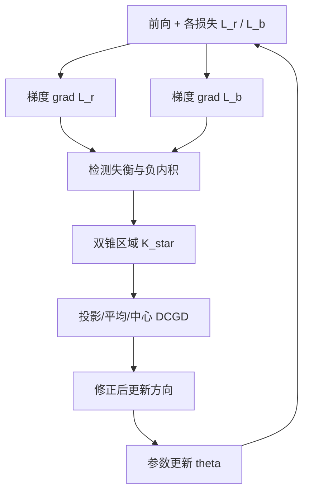
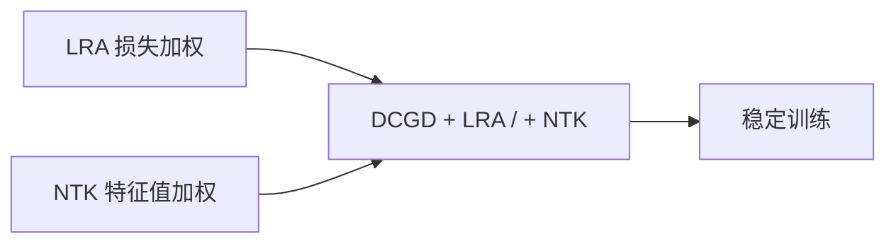

---
tags:
  - AI
  - PINN
  - 论文汇报
  - 自适应权重
date: 2026-06-10
paper_title: "Dual Cone Gradient Descent for Training Physics-Informed Neural Networks"
venue: "NeurIPS 2024"
venue_grade: "CCF-A"
arxiv: "2409.18426"
---

# DCGD：双锥梯度下降（NeurIPS 2024）

## 方法图示

> 当 PDE 残差梯度与边界梯度模长失衡且内积为负时，标准 Adam 更新可能使某项损失上升；DCGD 将更新方向投影到 **双锥区域 K***，保证与两项梯度内积均非负。

## 元信息

- **作者 / 年份**：Youngsik Hwang, Dong-Young Lim, 2024
- **发表于**：NeurIPS 2024（等级：CCF-A）
- **链接**：https://arxiv.org/abs/2409.18426 | https://proceedings.neurips.cc/paper_files/paper/2024/hash/b2b781badeeb49896c4b324c466ec442-Abstract-Conference.html
- **代码**：https://github.com/youngsikhwang/Dual-Cone-Gradient-Descent
- **引用数**：快速增长中（2024 顶会新文）

## 核心内容

指出 PINN 训练失败常伴随 **多目标梯度模长失衡** 与 **PDE/边界梯度负内积**（更新方向同时损害两项损失）。提出 **Dual Cone Gradient Descent（DCGD）**：每步将更新梯度约束在双锥区域，使与 ∇L_r、∇L_b 的内积均 ≥ 0；给出非凸收敛至 Pareto 驻点分析，并在 failure modes 与复杂 PDE 上优于 Adam/L-BFGS；可与 **LRA、NTK 加权** 叠加（DCGD+Center+LRA/NTK）。

## 创新点

1. 从 **几何/多目标优化** 角度解释 PINN 梯度病理，而非仅 rescale λ。
2. 三种 DCGD 变体（Projection / Average / Center）及收敛理论。
3. 与现有 **项级损失平衡（LRA、NTK）正交**，可 plug-in 增强。
4. NeurIPS 2024 正式发表，代码开源，便于在声波正演 baseline 上替换优化器。

## 相关汇报

| 汇报 | 关联理由 |
|------|----------|
| [[2026-06-05/04-ConFIG-无冲突梯度训练]] | 均解决 **梯度冲突**：ConFIG 用伪逆消除冲突方向，DCGD 用双锥约束；可对比两种 MOO 几何修正。 |
| [[2026-06-04/05-NTK-特征值加权]] | 论文明确将 DCGD 与 NTK 加权组合；本篇提供 **优化器层** 改进，NTK 汇报提供 **权重层** 改进。 |
| [[2026-06-09/20-梯度病态]] | 梯度病态是 DCGD 的问题动机；可联合阅读「病理诊断 → 双锥修正」。 |
| [[2026-06-06/04-MultiAdam-尺度不变优化器]] | 同为 ICML/NeurIPS 级 **训练算法** 改进；MultiAdam 做尺度不变，DCGD 做方向约束。 |
| [[2026-06-04/04-ReLoBRaLo-相对损失平衡]] | ReLoBRaLo 调 λ，DCGD 调 **更新方向**；二者可叠加做「权重 + 方向」双修复。 |

## 与我研究的关联

若 2D 声波 PINN 出现 PDE 残差降而边界/快照项升（或反之），可监控 ∇L 内积并在现有 Adam+λ 预训练外试 DCGD(Center)+LRA，作为低成本对照分支。

## 备注

- 汇报批次：2026-06-10 第 1 次触发
- 检索来源：WebSearch + arXiv

## 本地 PDF

![[2409.18426.pdf]]

- arXiv：https://arxiv.org/abs/2409.18426
- 文件：`每日论文/2026-06-10/2409.18426.pdf`
