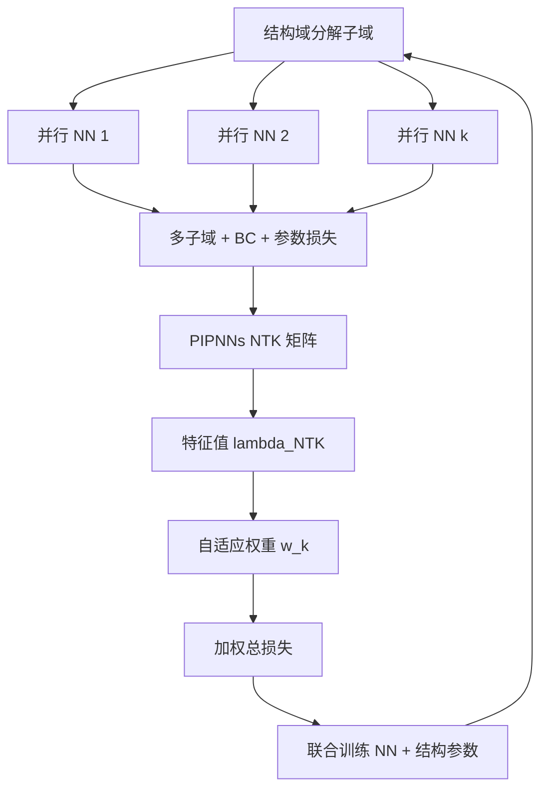
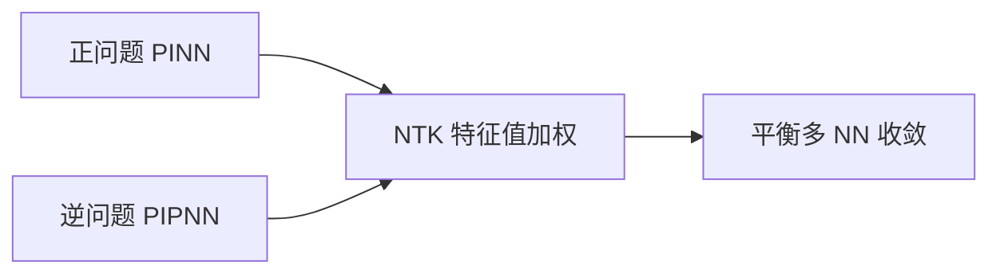

---
tags:
  - AI
  - PINN
  - 论文汇报
  - 自适应权重
date: 2026-06-10
paper_title: "Physics-Informed Parallel Neural Networks with self-adaptive loss weighting for the identification of continuous structural systems"
venue: "Computer Methods in Applied Mechanics and Engineering"
venue_grade: "SCI 一区"
doi: "10.1016/j.cma.2024.117042"
---

# PIPNN-NTK：并行子域 + NTK 自适应损失加权

## 方法图示

> 域分解为多个并行 NN（PIPNNs），损失项随子域与物理约束激增；用 **PIPNNs 的 NTK 矩阵特征值** 在线调整各损失权重，并耦合逆问题中结构参数演化。

## 元信息

- **作者 / 年份**：Aleksandra Radlińska 等（Penn State）, 2024
- **发表于**：Computer Methods in Applied Mechanics and Engineering, Vol. 427, 117042（等级：SCI 一区）
- **链接**：https://doi.org/10.1016/j.cma.2024.117042
- **引用数**：中等（CMAME 2024）

## 核心内容

在 **Physics-Informed Parallel Neural Networks（PIPNNs）** 框架（域分解 + 并行 NN 处理结构不连续）上，引入 **NTK 驱动的自适应损失加权**：根据 PIPNNs 的 NTK 矩阵特征值为各损失项（子域 PDE、界面、边界、未知结构参数）分配权重，使多 NN 与各物理约束 **收敛速率平衡**；逆问题中 NTK 同时反映 NN 训练与 **结构参数更新** 的耦合动态。

## 创新点

1. 将 Wang et al. 的 NTK 加权从单网络 **推广到并行多 NN + 逆问题**。
2. NTK 矩阵推导纳入 **未知结构参数变化**，权重随识别过程自适应。
3. 在杆、梁、板连续结构系统数值例中与独立模型对比，验证参数识别与场预测精度。
4. CMAME 一区发表，面向工程结构识别，与纯 forward PINN 加权形成应用场景对照。

## 相关汇报

| 汇报 | 关联理由 |
|------|----------|
| [[2026-06-04/05-NTK-特征值加权]] | 核心机制同源：均用 **NTK 特征值** 平衡损失；本篇扩展到 **并行子域 + 逆问题**。 |
| [[2026-06-09/16-XPINN]] | XPINN 亦用域分解；PIPNN 强调 **结构不连续 + 并行 NN**，NTK 加权解决子域间损失失衡。 |
| [[2026-06-07/02-lbPINNs-高斯MLE项级权重]] | lbPINNs 用 MLE 做项级权重；PIPNN-NTK 用 **核谱** 做项级权重，可对比 MLE vs NTK。 |
| [[2026-06-04/03-DB-PINN-双层次平衡]] | DB-PINN 用梯度统计做 inter/intra 平衡；PIPNN-NTK 用 NTK 特征值，同属 **项级自适应**。 |
| [[2026-06-10/02-DCGD-双锥梯度下降]] | DCGD 可与 NTK 加权叠加；本篇展示 NTK 加权在 **多网络复杂损失** 下的必要性。 |

## 与我研究的关联

若将来将 2D 声波域按炮检/分层做 XPINN/子域分解，多子域 PDE+界面+观测项损失失衡时可借鉴 PIPNN-NTK 的 **按子域 NTK 调权**；forward 问题可简化为不含结构参数项的 NTK 矩阵。

## 备注

- 汇报批次：2026-06-10 第 1 次触发
- 检索来源：WebSearch

## 本地 PDF

> 暂无本地 PDF（本篇无 arXiv 预印本，仅期刊发表）。

- DOI：https://doi.org/10.1016/j.cma.2024.117042
