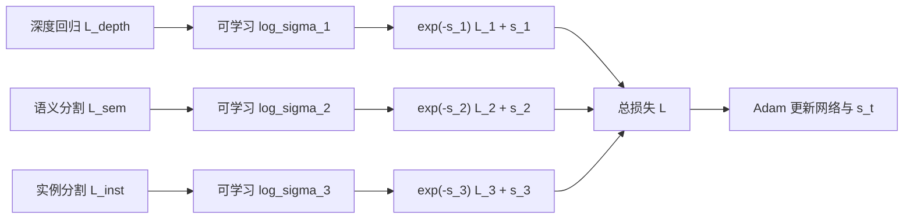
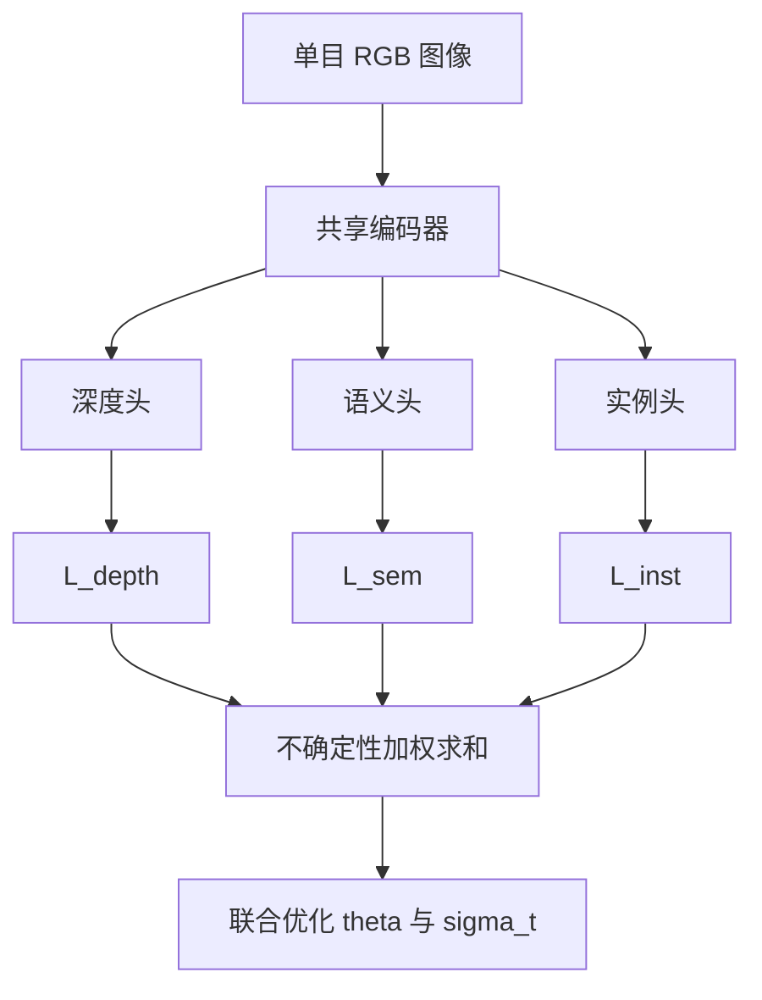

---
tags:
  - AI
  - PINN
  - 论文汇报
  - 自适应权重
date: 2026-06-11
paper_title: "Multi-Task Learning Using Uncertainty to Weigh Losses for Scene Geometry and Semantics"
venue: "CVPR 2018"
venue_grade: "CCF-A"
doi: "10.1109/CVPR.2018.00781"
arxiv: "1705.07115"
---

# Kendall 不确定性加权：多任务损失同方差不确定性（CVPR 2018）

## 方法图示

> 经典 **homoscedastic uncertainty** 多任务加权：每项任务学一个噪声尺度 \(\sigma_t\)，损失权重 \(\propto 1/\sigma_t^2\)，正则项 \(\log\sigma_t\) 防止 \(\sigma\to\infty\)。

## 元信息

- **作者 / 年份**：Alex Kendall, Yarin Gal, Roberto Cipolla, 2018
- **发表于**：IEEE/CVF Conference on Computer Vision and Pattern Recognition (CVPR 2018)（等级：**CCF-A**）
- **链接**：https://doi.org/10.1109/CVPR.2018.00781 | https://arxiv.org/abs/1705.07115 | [CVF PDF](https://openaccess.thecvf.com/content_cvpr_2018/papers/Kendall_Multi-Task_Learning_Using_CVPR_2018_paper.pdf)
- **引用数**：8000+（高被引奠基作）

## 核心内容

多任务学习中各任务损失量级、单位不同，手工调 \(\lambda_t\) 代价高。作者将每项任务的 **同方差 aleatoric uncertainty** \(\sigma_t\) 作为可学习参数，通过最大化高斯似然导出加权损失 \(\mathcal{L}=\sum_t \frac{1}{2\sigma_t^2}L_t + \log\sigma_t\)（实现中常学 \(\log\sigma_t^2\) 以保证数值稳定）。在单目图像上同时学习深度回归、语义分割与实例分割，**自动学到的权重优于**各任务单独训练的网络。

## 创新点

1. 从概率建模（高斯 MLE）** principled 地**导出多任务损失权重，而非启发式 GradNorm/手工 λ。
2. \(\log\sigma_t\) 正则防止网络通过无限放大噪声逃避难任务，权重对初始化相对鲁棒。
3. 同时覆盖 **回归与分类** 等多尺度目标，证明 uncertainty weighting 在场景理解多任务上的有效性。
4. 成为 PINN / 科学计算领域大量 **项级自适应 λ** 方法（lbPINNs、IAW-PINN、APINN 等）的理论源头。

## 相关汇报

| 汇报 | 关联理由 |
|------|----------|
| [[2026-06-07/02-lbPINNs-高斯MLE项级权重]] | 将 Kendall 高斯似然 **系统化移植到 PINN**，对 PDE/BC/数据项学 \(\epsilon_k\)，权重 \(\lambda_k\propto 1/\epsilon_k^2\)。 |
| [[2026-06-07/03-I-PINN-有界不确定性加权]] | 在 Kendall 式加权上加 **上界**，防止 PDE 残差权重被 BC/IC 压垮；直接回应 Kendall 在 PINN 中的失效模式。 |
| [[2026-06-06/01-APINN-多任务自适应加权]] | APINN 同样把 PINN 视为多任务学习，借鉴 uncertainty / 任务权重思想平衡多项损失。 |
| [[2026-06-04/04-ReLoBRaLo-相对损失平衡]] | ReLoBRaLo 用 **损失统计** 而非可学习 \(\sigma\)；与 Kendall 形成「可学习噪声 vs 相对进展」对照基线。 |
| [[01-C方案对比基线五篇精选]] | 精选对比文中 I-PINN 一节即 Kendall 路线在声波 C 方案实验中的延伸参照。 |

## 与我研究的关联

你项目 **E 方案**已采用 Kendall 式可学习 \(\sigma_k\) 加权；**C 方案**则用规则化相对进度 λ（非 MLE）。本篇是理解 E 为何在 full 实验中外推较差、以及 I-PINN「有界 Kendall」改进动机的 **必读原文**。建议在 `trainers.py` 增加 **Kendall 原版** 作为 A/B/C 之外的独立基线：\(L=\sum_k e^{-s_k}L_k+s_k\)，与 C 的 Softmax λ 直接对比收敛速度与 \(t=0.12s\) RMSE。

## 备注

- 汇报批次：2026-06-11 第 2 次触发（用户指定经典文献）
- 说明：非 PINN 专文，但是 PINN 自适应权重领域的 **奠基引用**；CVPR 2018 正式发表，arXiv 2017

## 本地 PDF

![[1705.07115.pdf]]

- arXiv：https://arxiv.org/abs/1705.07115
- 文件：`每日论文/2026-06-11/1705.07115.pdf`
